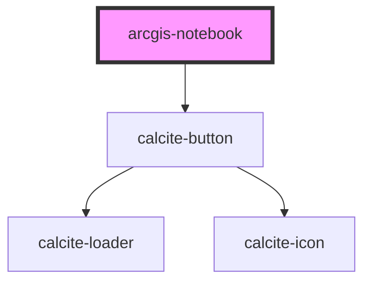

# arcgis-notebook

<!-- Auto Generated Below -->

## Properties

| Property | Attribute | Description | Type                  | Default                              |
| -------- | --------- | ----------- | --------------------- | ------------------------------------ |
| `item`   | `item`    |             | `string`              | `"9cd1f9bdc6794e63ae450087b3b67e05"` |
| `portal` | `portal`  |             | `string`              | `"https://www.arcgis.com"`           |
| `view`   | `view`    |             | `"edit" \| "preview"` | `"preview"`                          |

## Dependencies

### Depends on

- calcite-button

### Graph

----------------------------------------------

*Built with [StencilJS](https://stenciljs.com/)*
