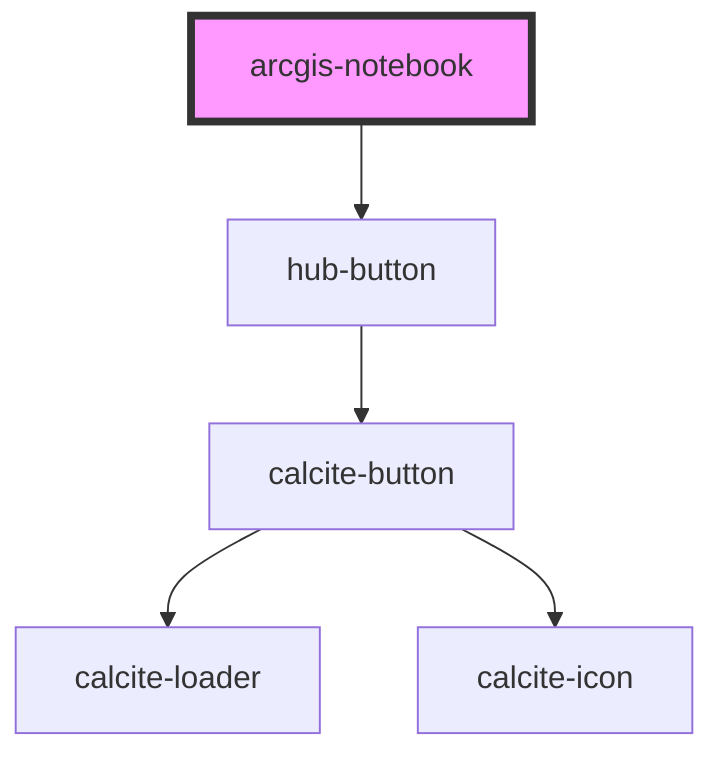

# arcgis-notebook

<!-- Auto Generated Below -->

## Properties

| Property   | Attribute  | Description                                 | Type                  | Default                              |
| ---------- | ---------- | ------------------------------------------- | --------------------- | ------------------------------------ |
| `clientid` | `clientid` | ClientID to identify the app launching auth | `string`              | `"WXC842NRBVB6NZ2r"`                 |
| `item`     | `item`     |                                             | `string`              | `"23bc9a4ea59d4bcea85b55b39ffcd866"` |
| `portal`   | `portal`   |                                             | `string`              | `"https://www.arcgis.com"`           |
| `session`  | `session`  | Serialized authentication information.      | `string`              | `undefined`                          |
| `view`     | `view`     |                                             | `"edit" \| "preview"` | `"preview"`                          |

## Dependencies

### Depends on

- [hub-button](../hub-button)

### Graph

----------------------------------------------

*Built with [StencilJS](https://stenciljs.com/)*
