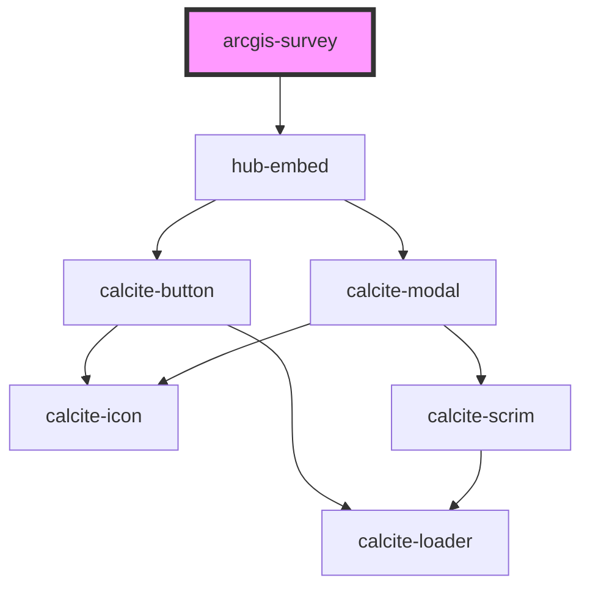

# arcgis-survey

<!-- Auto Generated Below -->

## Properties

| Property | Attribute | Description | Type     | Default                              |
| -------- | --------- | ----------- | -------- | ------------------------------------ |
| `item`   | `item`    |             | `string` | `"1a712571473448e891978869cd899b38"` |

## Dependencies

### Depends on

- [hub-embed](../hub-embed)

### Graph

----------------------------------------------

*Built with [StencilJS](https://stenciljs.com/)*
