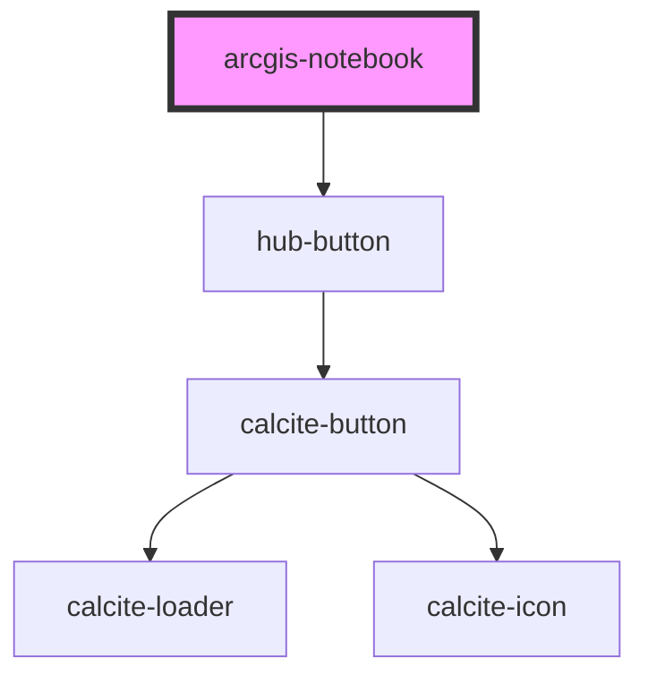

# arcgis-notebook

<!-- Auto Generated Below -->

## Properties

| Property       | Attribute       | Description                                                                                                                                        | Type                  | Default                    |
| -------------- | --------------- | -------------------------------------------------------------------------------------------------------------------------------------------------- | --------------------- | -------------------------- |
| `allowScripts` | `allow-scripts` | Notebook can include other Javascript libraries Useful for some charting libraries (e.g. Vega Altair) But may be a security concern. Default: true | `boolean`             | `true`                     |
| `clientid`     | `clientid`      | Optional ClientID to identify the app launching authentication Only required if accessing restricted notebooks                                     | `string`              | `""`                       |
| `item`         | `item`          | Notebook Item ID from ArcGIS Online or Enterprise Required                                                                                         | `string`              | `""`                       |
| `portal`       | `portal`        | ArcGIS Online or Enterprise URL                                                                                                                    | `string`              | `"https://www.arcgis.com"` |
| `session`      | `session`       | Optional serialized authentication information. Only required to access restricted notebooks.                                                      | `string`              | `undefined`                |
| `view`         | `view`          | Show the notebook preview (live/non-edit) or Edit Note: Edit currently blocked by ArcGIS security restrictions                                     | `"edit" \| "preview"` | `"preview"`                |

## Dependencies

### Depends on

- [hub-button](../../presentation/hub-button)

### Graph

----------------------------------------------

*Built with [StencilJS](https://stenciljs.com/)*
