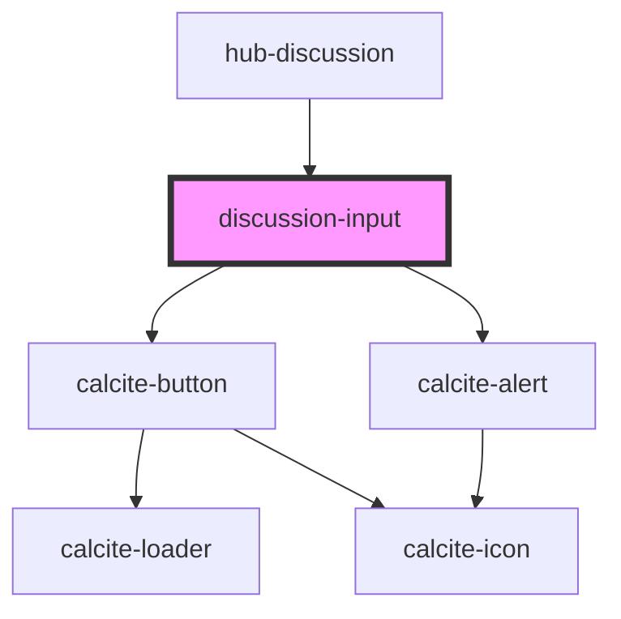

# discussion-input

<!-- Auto Generated Below -->

## Properties

| Property         | Attribute         | Description                                                                     | Type     | Default                    |
| ---------------- | ----------------- | ------------------------------------------------------------------------------- | -------- | -------------------------- |
| `annotationsUrl` | `annotations-url` | URL to this Hub's annotation service TODO: extract this implementation detail   | `string` | `undefined`                |
| `placeholder`    | `placeholder`     | Optional placeholder text for the input text area                               | `string` | `"Join the discussion..."` |
| `session`        | `session`         | Serialized authentication information.                                          | `string` | `undefined`                |
| `submit`         | `submit`          | Button string message                                                           | `string` | `"Share comment"`          |
| `target`         | `target`          | URI of the comment subject (e.g. item:4ef, item:4ef:feature:42:attribute:width) | `string` | `undefined`                |

## Events

| Event                | Description                                           | Type               |
| -------------------- | ----------------------------------------------------- | ------------------ |
| `eventAddAnnotation` | Event emitted when a comment is successfully commited | `CustomEvent<any>` |

## Dependencies

### Used by

 - [hub-discussion](../../containers/hub-discussion)

### Depends on

- calcite-button
- calcite-alert

### Graph

----------------------------------------------

*Built with [StencilJS](https://stenciljs.com/)*
