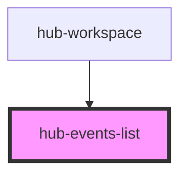

# hub-events-list

<!-- Auto Generated Below -->

## Properties

| Property  | Attribute | Description                            | Type     | Default     |
| --------- | --------- | -------------------------------------- | -------- | ----------- |
| `session` | `session` | Serialized authentication information. | `string` | `undefined` |

## Dependencies

### Used by

 - [hub-workspace](../../containers/hub-workspace)

### Graph

----------------------------------------------

*Built with [StencilJS](https://stenciljs.com/)*
