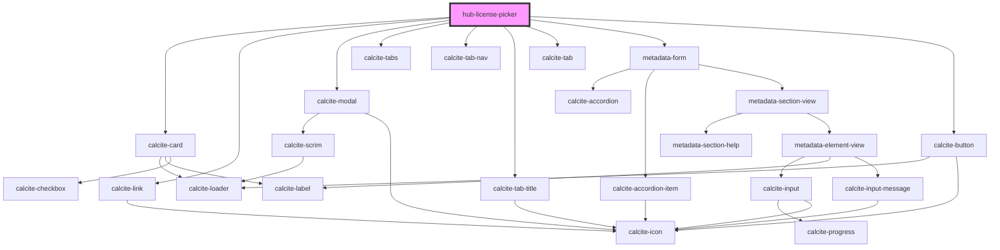

# hub-license-picker

<!-- Auto Generated Below -->

## Properties

| Property  | Attribute | Description | Type     | Default |
| --------- | --------- | ----------- | -------- | ------- |
| `license` | `license` |             | `string` | `"cc0"` |

## Dependencies

### Depends on

- calcite-card
- calcite-link
- calcite-modal
- calcite-tabs
- calcite-tab-nav
- calcite-tab-title
- calcite-tab
- [metadata-form](../metadata-form)
- calcite-button

### Graph

----------------------------------------------

*Built with [StencilJS](https://stenciljs.com/)*
