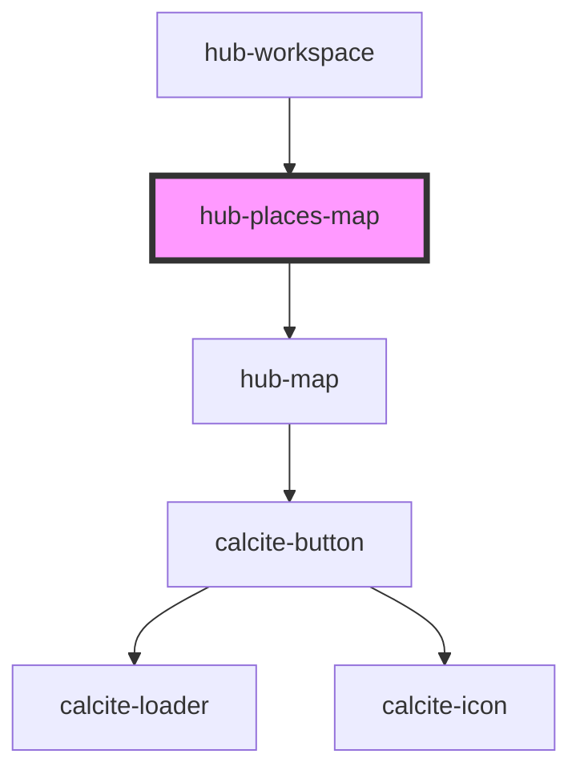

# hub-places-map

<!-- Auto Generated Below -->

## Properties

| Property    | Attribute    | Description                                                                         | Type               | Default     |
| ----------- | ------------ | ----------------------------------------------------------------------------------- | ------------------ | ----------- |
| `bindState` | `bind-state` | Choose to save or load places from user profile directly from session               | `boolean`          | `false`     |
| `mode`      | `mode`       | Option to view places map, or edit places map                                       | `"edit" \| "view"` | `"view"`    |
| `session`   | `session`    | Serialized authentication information.                                              | `string`           | `undefined` |
| `value`     | --           | Hub places array of geography. Property name `value` because re-used across editors | `IHubGeography[]`  | `[]`        |

## Dependencies

### Used by

 - [hub-workspace](../../containers/hub-workspace)

### Depends on

- [hub-map](../hub-map)

### Graph

----------------------------------------------

*Built with [StencilJS](https://stenciljs.com/)*
