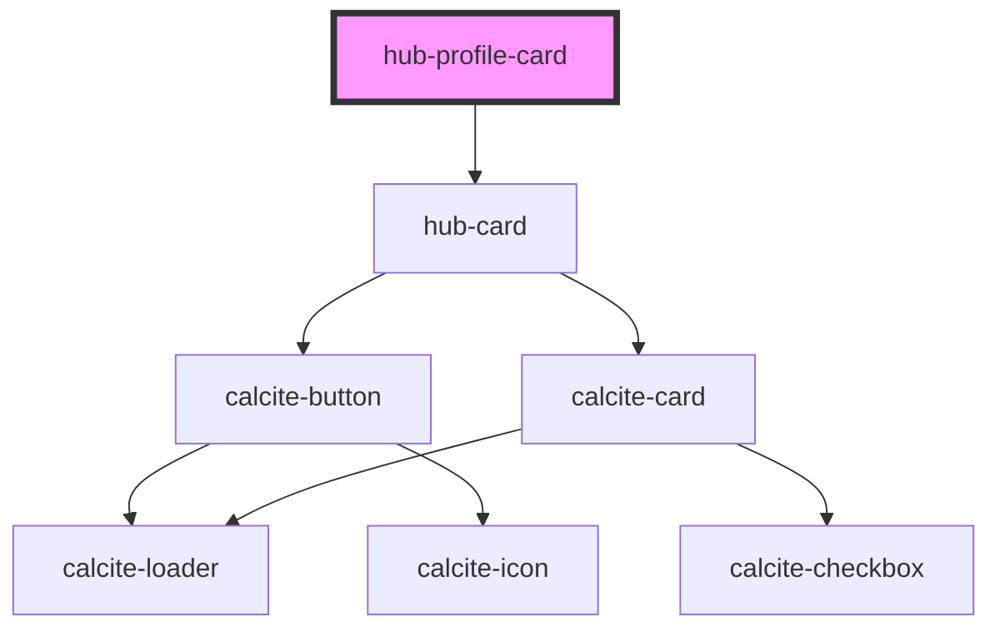

# hub-profile-card

<!-- Auto Generated Below -->

## Properties

| Property | Attribute | Description                                   | Type     | Default    |
| -------- | --------- | --------------------------------------------- | -------- | ---------- |
| `id`     | `id`      | ID For the profile. Username, Team ID, Org ID | `string` | `""`       |
| `type`   | `type`    | Which Profile: member, team                   | `string` | `"member"` |

## Dependencies

### Depends on

- [hub-card](../../presentation/hub-card)

### Graph

----------------------------------------------

*Built with [StencilJS](https://stenciljs.com/)*
