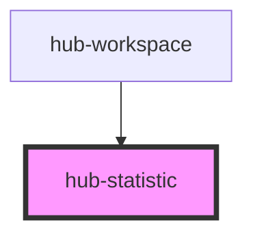

# hub-statistic

<!-- Auto Generated Below -->

## Properties

| Property | Attribute | Description | Type                | Default     |
| -------- | --------- | ----------- | ------------------- | ----------- |
| `label`  | `label`   |             | `string`            | `undefined` |
| `size`   | `size`    |             | `"l" \| "m" \| "s"` | `undefined` |
| `units`  | `units`   |             | `string`            | `undefined` |
| `value`  | `value`   |             | `number \| string`  | `undefined` |

## Dependencies

### Used by

 - [hub-workspace](../../containers/hub-workspace)

### Graph

----------------------------------------------

*Built with [StencilJS](https://stenciljs.com/)*
