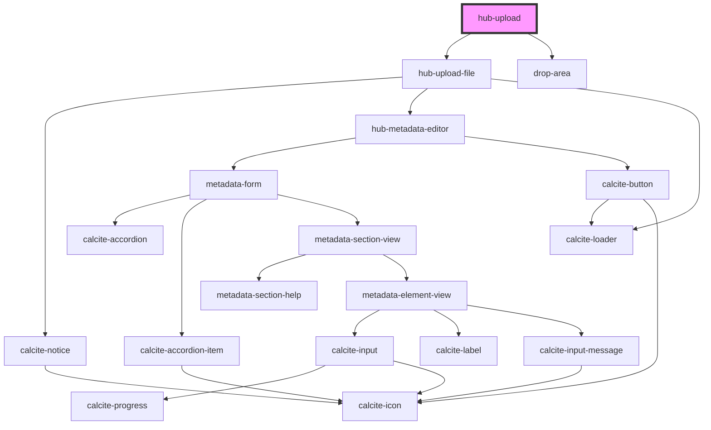

# hub-upload

POST https://dcdev.maps.arcgis.com/sharing/rest/content/users/aturner/addItem
type: CSV
typeKeywords: CSV

POST https://dcdev.maps.arcgis.com/sharing/rest/content/features/analyze
f: json
token: eN8zkcL7j3pAMmAmFB91Pbhg_AqCeub52gd_ziNjlLJi7lNE9r-iYdRmVkDoclXug57f7n3hBM05wbwDjz6iq8Pt85NRUGQ4RMCj3wxIx7Yx_LUbWjy9Ez6NpT_idWJQ4d5mxywYoqFYEDD74_ez2nh2RF9rEqDodowKW8NR1EhtnyMjpjb-yGqKuQx_0yga8_J2dHT9IKhxkH0QB9a7xbhzrxxXgea01zth2dw000k.
analyzeParameters: {"enableGlobalGeocoding":true,"sourceLocale":"en","geocodeServiceUrl":"https://geocode.arcgis.com/arcgis/rest/services/World/GeocodeServer","sourceCountry":"","sourceCountryHint":"world"}
filetype: csv
itemid: 94da5b97e8f544ca99b4a5e5043dac65

RESPONSE:
{"publishParameters":{"type":"csv","name":"data","useBulkInserts":true,"sourceUrl":"","locationType":"coordinates","maxRecordCount":1000,"latitudeFieldName":"LATITUDE","longitudeFieldName":"LONGITUDE","geocodeServiceUrl":"https://geocode.arcgis.com/arcgis/rest/services/World/GeocodeServer","sourceCountry":"world","sourceLocale":"en","standardizedFieldNames":{"Address":"Address or Place","Address2":"Address2","Address3":"Address3","Neighborhood":"Neighborhood","City":"City","Subregion":"Subregion","Region":"Region","Postal":"Postal","PostalExt":"Postal Extension","CountryCode":"Country"},"columnDelimiter":",","qualifier":"\"","sourceSR":{"wkid":4326,"latestWkid":4326},"targetSR":{"wkid":102100,"latestWkid":3857},"editorTrackingInfo":{"enableEditorTracking":false,"enableOwnershipAccessControl":false,"allowOthersToQuery":true,"allowOthersToUpdate":true,"allowOthersToDelete":false,"allowAnonymousToQuery":true,"allowAnonymousToUpdate":true,"allowAnonymousToDelete":true},"layerInfo":{"currentVersion":10.7,"id":0,"name":"","type":"Table","displayField":"","description":"","copyrightText":"","defaultVisibility":true,"relationships":[],"isDataVersioned":false,"supportsAppend":true,"supportsCalculate":true,"supportsASyncCalculate":true,"supportsTruncate":false,"supportsAttachmentsByUploadId":true,"supportsAttachmentsResizing":true,"supportsRollbackOnFailureParameter":true,"supportsStatistics":true,"supportsExceedsLimitStatistics":true,"supportsAdvancedQueries":true,"supportsValidateSql":true,"supportsCoordinatesQuantization":true,"supportsFieldDescriptionProperty":true,"supportsQuantizationEditMode":true,"supportsApplyEditsWithGlobalIds":false,"advancedQueryCapabilities":{"supportsPagination":true,"supportsPaginationOnAggregatedQueries":true,"supportsQueryRelatedPagination":true,"supportsQueryWithDistance":true,"supportsReturningQueryExtent":true,"supportsStatistics":true,"supportsOrderBy":true,"supportsDistinct":true,"supportsQueryWithResultType":true,"supportsSqlExpression":true,"supportsAdvancedQueryRelated":true,"supportsCountDistinct":true,"supportsPercentileStatistics":true,"supportsReturningGeometryCentroid":false,"supportsQueryWithDatumTransformation":true,"supportsHavingClause":true,"supportsOutFieldSQLExpression":true,"supportsMaxRecordCountFactor":true,"supportsTopFeaturesQuery":true,"supportsQueryWithCacheHint":true},"useStandardizedQueries":false,"geometryType":"esriGeometryPoint","drawingInfo":{"renderer":{"type":"simple","symbol":{"type":"esriPMS","url":"RedSphere.png","imageData":"iVBORw0KGgoAAAANSUhEUgAAAEAAAABACAYAAACqaXHeAAAABGdBTUEAALGPC/xhBQAAACBjSFJNAAB6JgAAgIQAAPoAAACA6AAAdTAAAOpgAAA6mAAAF3CculE8AAAACXBIWXMAAA7DAAAOwwHHb6hkAAAAGXRFWHRTb2Z0d2FyZQBQYWludC5ORVQgdjMuNS4xTuc4+QAAB3VJREFUeF7tmPlTlEcexnve94U5mANQbgQSbgiHXHINlxpRIBpRI6wHorLERUmIisKCQWM8cqigESVQS1Kx1piNi4mW2YpbcZONrilE140RCTcy3DDAcL/zbJP8CYPDL+9Ufau7uqb7eZ7P+/a8PS8hwkcgIBAQCAgEBAICAYGAQEAgIBAQCAgEBAICAYGAQEAgIBAQCDx/AoowKXFMUhD3lQrioZaQRVRS+fxl51eBTZUTdZ41U1Rox13/0JF9csGJ05Qv4jSz/YPWohtvLmSKN5iTGGqTm1+rc6weICOBRbZs1UVnrv87T1PUeovxyNsUP9P6n5cpHtCxu24cbrmwKLdj+osWiqrVKhI0xzbmZ7m1SpJ+1pFpvE2DPvGTomOxAoNLLKGLscZYvB10cbYYjrJCb7A5mrxleOBqim+cWJRakZY0JfnD/LieI9V1MrKtwokbrAtU4Vm0A3TJnphJD4B+RxD0u0LA7w7FTE4oprOCMbklEGNrfdGf4IqnQTb4wc0MFTYibZqM7JgjO8ZdJkpMln/sKu16pHZGb7IfptIWg389DPp9kcChWODoMuDdBOhL1JgpisbUvghM7AqFbtNiaFP80RLnhbuBdqi0N+1dbUpWGde9gWpuhFi95yL7sS7BA93JAb+Fn8mh4QujgPeTgb9kAZf3Apd2A+fXQ38yHjOHozB1IAJjOSEY2RSIwVUv4dd4X9wJccGHNrJ7CYQ4GGjLeNNfM+dyvgpzQstKf3pbB2A6m97uBRE0/Ergcxr8hyqg7hrwn0vAtRIKIRX6Y2pMl0RhIj8co9nBGFrvh55l3ngU7YObng7IVnFvGS+BYUpmHziY/Ls2zgP9SX50by/G9N5w6I+ogYvpwK1SoOlHQNsGfWcd9Peqof88B/rTyzF9hAIopAByQzC0JQB9ST5oVnvhnt+LOGsprvUhxNIwa0aY7cGR6Cp7tr8+whkjawIxkRWC6YJI6N+lAKq3Qf/Tx+B77oGfaQc/8hB8w2Xwtw9Bf3kzZspXY/JIDEbfpAB2BKLvVV90Jvjgoac9vpRxE8kciTVCBMMkNirJ7k/tRHyjtxwjKV4Yp3t/6s+R4E+/DH3N6+BrS8E314Dvvg2+/Sb4hxfBf5sP/up2TF3ZhonK1zD6dhwGdwail26DzqgX8MRKiq9ZBpkSkmeYOyPM3m9Jjl+1Z9D8AgNtlAq6bZ70qsZi+q+bwV/7I/hbB8D/dAr8Axq89iz474p/G5++koHJy1sx/lkGdBc2YjA3HF0rHNHuboomuQj/5DgclIvOGCGCYRKFFuTMV7YUAD3VDQaLMfyqBcZORGPy01QKYSNm/rYV/Nd/Av9NHvgbueBrsjDzRQamKKDxT9Kgq1iLkbIUDOSHoiNcgnYHgnYZi+9ZExSbiSoMc2eE2flKcuJLa4KGRQz6/U0wlGaP0feiMH4uFpMXEjBVlYjp6lWY+SSZtim0kulYMiYuJEJXuhTDJ9UYPByOvoIwdCxfgE4bAo0Jh39xLAoVpMwIEQyTyFCQvGpLon9sJ0K3J4OBDDcMH1dj9FQsxkrjMPFRPCbOx2GyfLal9VEcxstioTulxjAFNfROJPqLl6Bnfyg6V7ugz5yBhuHwrZjBdiU5YJg7I8wOpifAKoVIW7uQ3rpOBH2b3ekVjYT2WCRG3o+mIGKgO0OrlIaebU/HYOQDNbQnojB4NJyGD0NPfjA0bwTRE6Q7hsUcWhkWN8yZqSQlWWGECAZLmJfJmbrvVSI8taK37xpbdB/wQW8xPee/8xIGjvlj8IQ/hk4G0JbWcX8MHPVDX4kveoq8ocn3xLM33NCZRcPHOGJYZIKfpQyq7JjHS6yJjcHujLHADgkpuC7h8F8zEVqXSNC2awE69lqhs8AamkO26HrbDt2H7dBVQov2NcW26CiwQtu+BWjdY4n2nZboTbfCmKcCnRyDO/YmyLPnDlHvjDH8G6zhS9/wlEnYR7X00fWrFYuWdVI0ZpuhcbcczW/R2qdAcz6t/bRov4mONeaaoYl+p22rHF0bVNAmKtBvweIXGxNcfFH8eNlC4m6wMWMusEnKpn5hyo48pj9gLe4SNG9QoGGLAk8z5XiaJUd99u8122/IpBA2K9BGg2vWWKAvRYVeLzEa7E1R422m2+MsSTem97nSYnfKyN6/mzATv7AUgqcMrUnmaFlLX3ysM0fj+t/b5lQLtK22QEfyAmiSLKFZpUJ7kBRPXKW4HqCYynWVHKSG2LkyZex1uO1mZM9lKem9Tx9jjY5iNEYo0bKMhn7ZAu0r6H5PpLXCAq0rKJClSjSGynE/QIkrQYqBPe6S2X+AJsY2Ped6iWZk6RlL0c2r5szofRsO9R5S1IfQLRCpQL1aifoYFerpsbkuTImaUJXuXIDiH6/Ys8vm3Mg8L2i20YqsO7fItKLcSXyn0kXccclVqv3MS6at9JU/Ox+ouns+SF6Z4cSupz7l8+z1ucs7LF1AQjOdxfGZzmx8Iu1TRcfnrioICAQEAgIBgYBAQCAgEBAICAQEAgIBgYBAQCAgEBAICAQEAv8H44b/6ZiGvGAAAAAASUVORK5CYII=","contentType":"image/png","width":15,"height":15}}},"allowGeometryUpdates":true,"hasAttachments":false,"htmlPopupType":"","hasM":false,"hasZ":false,"globalIdField":"","typeIdField":"","fields":[{"name":"X","type":"esriFieldTypeDouble","alias":"X","sqlType":"sqlTypeFloat","nullable":true,"editable":true,"domain":null,"defaultValue":null,"locationType":"unknown"},{"name":"Y","type":"esriFieldTypeDouble","alias":"Y","sqlType":"sqlTypeFloat","nullable":true,"editable":true,"domain":null,"defaultValue":null,"locationType":"unknown"},{"name":"OBJECTID","type":"esriFieldTypeInteger","alias":"OBJECTID","sqlType":"sqlTypeInteger","nullable":true,"editable":true,"domain":null,"defaultValue":null,"locationType":"unknown"},{"name":"CRIMEID","type":"esriFieldTypeInteger","alias":"CRIMEID","sqlType":"sqlTypeInteger","nullable":true,"editable":true,"domain":null,"defaultValue":null,"locationType":"unknown"},{"name":"CCN","type":"esriFieldTypeInteger","alias":"CCN","sqlType":"sqlTypeInteger","nullable":true,"editable":true,"domain":null,"defaultValue":null,"locationType":"unknown"},{"name":"REPORTDATE","type":"esriFieldTypeDate","alias":"REPORTDATE","sqlType":"sqlTypeDate","length":256,"nullable":true,"editable":true,"domain":null,"defaultValue":null,"locationType":"unknown"},{"name":"ROUTEID","type":"esriFieldTypeInteger","alias":"ROUTEID","sqlType":"sqlTypeInteger","nullable":true,"editable":true,"domain":null,"defaultValue":null,"locationType":"unknown"},{"name":"MEASURE","type":"esriFieldTypeDouble","alias":"MEASURE","sqlType":"sqlTypeFloat","nullable":true,"editable":true,"domain":null,"defaultValue":null,"locationType":"unknown"},{"name":"OFFSET","type":"esriFieldTypeDouble","alias":"OFFSET","sqlType":"sqlTypeFloat","nullable":true,"editable":true,"domain":null,"defaultValue":null,"locationType":"unknown"},{"name":"STREETSEGID","type":"esriFieldTypeInteger","alias":"STREETSEGID","sqlType":"sqlTypeInteger","nullable":true,"editable":true,"domain":null,"defaultValue":null,"locationType":"unknown"},{"name":"ROADWAYSEGID","type":"esriFieldTypeInteger","alias":"ROADWAYSEGID","sqlType":"sqlTypeInteger","nullable":true,"editable":true,"domain":null,"defaultValue":null,"locationType":"unknown"},{"name":"FROMDATE","type":"esriFieldTypeDate","alias":"FROMDATE","sqlType":"sqlTypeDate","length":256,"nullable":true,"editable":true,"domain":null,"defaultValue":null,"locationType":"unknown"},{"name":"TODATE","type":"esriFieldTypeString","alias":"TODATE","sqlType":"sqlTypeNVarchar","length":8000,"nullable":true,"editable":true,"domain":null,"defaultValue":null,"locationType":"unknown"},{"name":"MARID","type":"esriFieldTypeInteger","alias":"MARID","sqlType":"sqlTypeInteger","nullable":true,"editable":true,"domain":null,"defaultValue":null,"locationType":"unknown"},{"name":"ADDRESS","type":"esriFieldTypeString","alias":"ADDRESS","sqlType":"sqlTypeNVarchar","length":8000,"nullable":true,"editable":true,"domain":null,"defaultValue":null,"locationType":"unknown"},{"name":"LATITUDE","type":"esriFieldTypeDouble","alias":"LATITUDE","sqlType":"sqlTypeDouble","nullable":true,"editable":true,"domain":null,"defaultValue":null,"locationType":"latitude"},{"name":"LONGITUDE","type":"esriFieldTypeDouble","alias":"LONGITUDE","sqlType":"sqlTypeDouble","nullable":true,"editable":true,"domain":null,"defaultValue":null,"locationType":"longitude"},{"name":"XCOORD","type":"esriFieldTypeDouble","alias":"XCOORD","sqlType":"sqlTypeFloat","nullable":true,"editable":true,"domain":null,"defaultValue":null,"locationType":"unknown"},{"name":"YCOORD","type":"esriFieldTypeDouble","alias":"YCOORD","sqlType":"sqlTypeFloat","nullable":true,"editable":true,"domain":null,"defaultValue":null,"locationType":"unknown"},{"name":"WARD","type":"esriFieldTypeString","alias":"WARD","sqlType":"sqlTypeNVarchar","length":8000,"nullable":true,"editable":true,"domain":null,"defaultValue":null,"locationType":"unknown"},{"name":"EVENTID","type":"esriFieldTypeString","alias":"EVENTID","sqlType":"sqlTypeNVarchar","length":8000,"nullable":true,"editable":true,"domain":null,"defaultValue":null,"locationType":"unknown"},{"name":"MAR_ADDRESS","type":"esriFieldTypeString","alias":"MAR_ADDRESS","sqlType":"sqlTypeNVarchar","length":8000,"nullable":true,"editable":true,"domain":null,"defaultValue":null,"locationType":"unknown"},{"name":"MAR_SCORE","type":"esriFieldTypeInteger","alias":"MAR_SCORE","sqlType":"sqlTypeInteger","nullable":true,"editable":true,"domain":null,"defaultValue":null,"locationType":"unknown"},{"name":"MAJORINJURIES_BICYCLIST","type":"esriFieldTypeInteger","alias":"MAJORINJURIES_BICYCLIST","sqlType":"sqlTypeInteger","nullable":true,"editable":true,"domain":null,"defaultValue":null,"locationType":"unknown"},{"name":"MINORINJURIES_BICYCLIST","type":"esriFieldTypeInteger","alias":"MINORINJURIES_BICYCLIST","sqlType":"sqlTypeInteger","nullable":true,"editable":true,"domain":null,"defaultValue":null,"locationType":"unknown"},{"name":"UNKNOWNINJURIES_BICYCLIST","type":"esriFieldTypeInteger","alias":"UNKNOWNINJURIES_BICYCLIST","sqlType":"sqlTypeInteger","nullable":true,"editable":true,"domain":null,"defaultValue":null,"locationType":"unknown"},{"name":"FATAL_BICYCLIST","type":"esriFieldTypeInteger","alias":"FATAL_BICYCLIST","sqlType":"sqlTypeInteger","nullable":true,"editable":true,"domain":null,"defaultValue":null,"locationType":"unknown"},{"name":"MAJORINJURIES_DRIVER","type":"esriFieldTypeInteger","alias":"MAJORINJURIES_DRIVER","sqlType":"sqlTypeInteger","nullable":true,"editable":true,"domain":null,"defaultValue":null,"locationType":"unknown"},{"name":"MINORINJURIES_DRIVER","type":"esriFieldTypeInteger","alias":"MINORINJURIES_DRIVER","sqlType":"sqlTypeInteger","nullable":true,"editable":true,"domain":null,"defaultValue":null,"locationType":"unknown"},{"name":"UNKNOWNINJURIES_DRIVER","type":"esriFieldTypeInteger","alias":"UNKNOWNINJURIES_DRIVER","sqlType":"sqlTypeInteger","nullable":true,"editable":true,"domain":null,"defaultValue":null,"locationType":"unknown"},{"name":"FATAL_DRIVER","type":"esriFieldTypeInteger","alias":"FATAL_DRIVER","sqlType":"sqlTypeInteger","nullable":true,"editable":true,"domain":null,"defaultValue":null,"locationType":"unknown"},{"name":"MAJORINJURIES_PEDESTRIAN","type":"esriFieldTypeInteger","alias":"MAJORINJURIES_PEDESTRIAN","sqlType":"sqlTypeInteger","nullable":true,"editable":true,"domain":null,"defaultValue":null,"locationType":"unknown"},{"name":"MINORINJURIES_PEDESTRIAN","type":"esriFieldTypeInteger","alias":"MINORINJURIES_PEDESTRIAN","sqlType":"sqlTypeInteger","nullable":true,"editable":true,"domain":null,"defaultValue":null,"locationType":"unknown"},{"name":"UNKNOWNINJURIES_PEDESTRIAN","type":"esriFieldTypeInteger","alias":"UNKNOWNINJURIES_PEDESTRIAN","sqlType":"sqlTypeInteger","nullable":true,"editable":true,"domain":null,"defaultValue":null,"locationType":"unknown"},{"name":"FATAL_PEDESTRIAN","type":"esriFieldTypeInteger","alias":"FATAL_PEDESTRIAN","sqlType":"sqlTypeInteger","nullable":true,"editable":true,"domain":null,"defaultValue":null,"locationType":"unknown"},{"name":"TOTAL_VEHICLES","type":"esriFieldTypeInteger","alias":"TOTAL_VEHICLES","sqlType":"sqlTypeInteger","nullable":true,"editable":true,"domain":null,"defaultValue":null,"locationType":"unknown"},{"name":"TOTAL_BICYCLES","type":"esriFieldTypeInteger","alias":"TOTAL_BICYCLES","sqlType":"sqlTypeInteger","nullable":true,"editable":true,"domain":null,"defaultValue":null,"locationType":"unknown"},{"name":"TOTAL_PEDESTRIANS","type":"esriFieldTypeInteger","alias":"TOTAL_PEDESTRIANS","sqlType":"sqlTypeInteger","nullable":true,"editable":true,"domain":null,"defaultValue":null,"locationType":"unknown"},{"name":"PEDESTRIANSIMPAIRED","type":"esriFieldTypeInteger","alias":"PEDESTRIANSIMPAIRED","sqlType":"sqlTypeInteger","nullable":true,"editable":true,"domain":null,"defaultValue":null,"locationType":"unknown"},{"name":"BICYCLISTSIMPAIRED","type":"esriFieldTypeInteger","alias":"BICYCLISTSIMPAIRED","sqlType":"sqlTypeInteger","nullable":true,"editable":true,"domain":null,"defaultValue":null,"locationType":"unknown"},{"name":"DRIVERSIMPAIRED","type":"esriFieldTypeInteger","alias":"DRIVERSIMPAIRED","sqlType":"sqlTypeInteger","nullable":true,"editable":true,"domain":null,"defaultValue":null,"locationType":"unknown"},{"name":"TOTAL_TAXIS","type":"esriFieldTypeInteger","alias":"TOTAL_TAXIS","sqlType":"sqlTypeInteger","nullable":true,"editable":true,"domain":null,"defaultValue":null,"locationType":"unknown"},{"name":"TOTAL_GOVERNMENT","type":"esriFieldTypeInteger","alias":"TOTAL_GOVERNMENT","sqlType":"sqlTypeInteger","nullable":true,"editable":true,"domain":null,"defaultValue":null,"locationType":"unknown"},{"name":"SPEEDING_INVOLVED","type":"esriFieldTypeInteger","alias":"SPEEDING_INVOLVED","sqlType":"sqlTypeInteger","nullable":true,"editable":true,"domain":null,"defaultValue":null,"locationType":"unknown"},{"name":"NEARESTINTROUTEID","type":"esriFieldTypeInteger","alias":"NEARESTINTROUTEID","sqlType":"sqlTypeInteger","nullable":true,"editable":true,"domain":null,"defaultValue":null,"locationType":"unknown"},{"name":"NEARESTINTSTREETNAME","type":"esriFieldTypeString","alias":"NEARESTINTSTREETNAME","sqlType":"sqlTypeNVarchar","length":8000,"nullable":true,"editable":true,"domain":null,"defaultValue":null,"locationType":"unknown"},{"name":"OFFINTERSECTION","type":"esriFieldTypeDouble","alias":"OFFINTERSECTION","sqlType":"sqlTypeFloat","nullable":true,"editable":true,"domain":null,"defaultValue":null,"locationType":"unknown"},{"name":"INTAPPROACHDIRECTION","type":"esriFieldTypeString","alias":"INTAPPROACHDIRECTION","sqlType":"sqlTypeNVarchar","length":8000,"nullable":true,"editable":true,"domain":null,"defaultValue":null,"locationType":"unknown"},{"name":"LOCATIONERROR","type":"esriFieldTypeString","alias":"LOCATIONERROR","sqlType":"sqlTypeNVarchar","length":8000,"nullable":true,"editable":true,"domain":null,"defaultValue":null,"locationType":"unknown"},{"name":"LASTUPDATEDATE","type":"esriFieldTypeDate","alias":"LASTUPDATEDATE","sqlType":"sqlTypeDate","length":256,"nullable":true,"editable":true,"domain":null,"defaultValue":null,"locationType":"unknown"},{"name":"MPDLATITUDE","type":"esriFieldTypeDouble","alias":"MPDLATITUDE","sqlType":"sqlTypeFloat","nullable":true,"editable":true,"domain":null,"defaultValue":null,"locationType":"unknown"},{"name":"MPDLONGITUDE","type":"esriFieldTypeDouble","alias":"MPDLONGITUDE","sqlType":"sqlTypeFloat","nullable":true,"editable":true,"domain":null,"defaultValue":null,"locationType":"unknown"},{"name":"MPDGEOX","type":"esriFieldTypeDouble","alias":"MPDGEOX","sqlType":"sqlTypeFloat","nullable":true,"editable":true,"domain":null,"defaultValue":null,"locationType":"unknown"},{"name":"MPDGEOY","type":"esriFieldTypeDouble","alias":"MPDGEOY","sqlType":"sqlTypeFloat","nullable":true,"editable":true,"domain":null,"defaultValue":null,"locationType":"unknown"}],"indexes":[],"types":[],"templates":[{"name":"New Feature","description":"","drawingTool":"esriFeatureEditToolPoint","prototype":{"attributes":{"X":null,"Y":null,"OBJECTID":null,"CRIMEID":null,"CCN":null,"REPORTDATE":null,"ROUTEID":null,"MEASURE":null,"OFFSET":null,"STREETSEGID":null,"ROADWAYSEGID":null,"FROMDATE":null,"TODATE":null,"MARID":null,"ADDRESS":null,"LATITUDE":null,"LONGITUDE":null,"XCOORD":null,"YCOORD":null,"WARD":null,"EVENTID":null,"MAR_ADDRESS":null,"MAR_SCORE":null,"MAJORINJURIES_BICYCLIST":null,"MINORINJURIES_BICYCLIST":null,"UNKNOWNINJURIES_BICYCLIST":null,"FATAL_BICYCLIST":null,"MAJORINJURIES_DRIVER":null,"MINORINJURIES_DRIVER":null,"UNKNOWNINJURIES_DRIVER":null,"FATAL_DRIVER":null,"MAJORINJURIES_PEDESTRIAN":null,"MINORINJURIES_PEDESTRIAN":null,"UNKNOWNINJURIES_PEDESTRIAN":null,"FATAL_PEDESTRIAN":null,"TOTAL_VEHICLES":null,"TOTAL_BICYCLES":null,"TOTAL_PEDESTRIANS":null,"PEDESTRIANSIMPAIRED":null,"BICYCLISTSIMPAIRED":null,"DRIVERSIMPAIRED":null,"TOTAL_TAXIS":null,"TOTAL_GOVERNMENT":null,"SPEEDING_INVOLVED":null,"NEARESTINTROUTEID":null,"NEARESTINTSTREETNAME":null,"OFFINTERSECTION":null,"INTAPPROACHDIRECTION":null,"LOCATIONERROR":null,"LASTUPDATEDATE":null,"MPDLATITUDE":null,"MPDLONGITUDE":null,"MPDGEOX":null,"MPDGEOY":null}}}],"supportedQueryFormats":"JSON, geoJSON","hasStaticData":false,"maxRecordCount":-1,"standardMaxRecordCount":32000,"tileMaxRecordCount":8000,"maxRecordCountFactor":1,"capabilities":"Create,Delete,Query,Update,Editing"}},"records":[{"attributes":{"X":"-77.065679985100005","Y":"38.947902688500001","OBJECTID":"77326120","CRIMEID":"27142928","CCN":"16203762","REPORTDATE":"2016-12-02T01:02:56.000Z","ROUTEID":"11025152","MEASURE":"0","OFFSET":"0","STREETSEGID":"290","ROADWAYSEGID":"383","FROMDATE":"2016-12-01T05:00:00.000Z","TODATE":"","MARID":"276031","ADDRESS":"CONNECTICUT AVENUE NW & ALBEMARLE STREET NW","LATITUDE":"38.947895","LONGITUDE":"-77.065678","XCOORD":"394306.69","YCOORD":"142224.09","WARD":"Ward 3","EVENTID":"{B15408F7-A65E-4027-89AF-BA5D333BD55B}","MAR_ADDRESS":"4444 CONNECTICUT AVENUE NW","MAR_SCORE":"200","MAJORINJURIES_BICYCLIST":"0","MINORINJURIES_BICYCLIST":"0","UNKNOWNINJURIES_BICYCLIST":"0","FATAL_BICYCLIST":"0","MAJORINJURIES_DRIVER":"0","MINORINJURIES_DRIVER":"0","UNKNOWNINJURIES_DRIVER":"0","FATAL_DRIVER":"0","MAJORINJURIES_PEDESTRIAN":"0","MINORINJURIES_PEDESTRIAN":"0","UNKNOWNINJURIES_PEDESTRIAN":"0","FATAL_PEDESTRIAN":"0","TOTAL_VEHICLES":"2","TOTAL_BICYCLES":"0","TOTAL_PEDESTRIANS":"0","PEDESTRIANSIMPAIRED":"0","BICYCLISTSIMPAIRED":"0","DRIVERSIMPAIRED":"0","TOTAL_TAXIS":"0","TOTAL_GOVERNMENT":"1","SPEEDING_INVOLVED":"0","NEARESTINTROUTEID":"11009492","NEARESTINTSTREETNAME":"ALBEMARLE ST NW","OFFINTERSECTION":"0.870668","INTAPPROACHDIRECTION":"Northwest","LOCATIONERROR":"","LASTUPDATEDATE":"2018-05-25T17:35:13.000Z","MPDLATITUDE":"38.947895","MPDLONGITUDE":"-77.065678","MPDGEOX":"394306.69","MPDGEOY":"142224.09"}},{"attributes":{"X":"-77.000571699399998","Y":"38.900466992600002","OBJECTID":"77326121","CRIMEID":"27947796","CCN":"19024161","REPORTDATE":"2019-02-10T19:42:02.000Z","ROUTEID":"12000402","MEASURE":"28.268","OFFSET":"14.813433","STREETSEGID":"4445","ROADWAYSEGID":"4383","FROMDATE":"2019-02-10T05:00:00.000Z","TODATE":"","MARID":"28326","ADDRESS":"400 H STREET NE","LATITUDE":"38.90046","LONGITUDE":"-77.000569","XCOORD":"399950.607","YCOORD":"136956.277","WARD":"Ward 6","EVENTID":"{1C90FF27-0299-41B8-BC17-FAE55AB33D51}","MAR_ADDRESS":"400 H STREET NE","MAR_SCORE":"200","MAJORINJURIES_BICYCLIST":"0","MINORINJURIES_BICYCLIST":"0","UNKNOWNINJURIES_BICYCLIST":"0","FATAL_BICYCLIST":"0","MAJORINJURIES_DRIVER":"0","MINORINJURIES_DRIVER":"1","UNKNOWNINJURIES_DRIVER":"0","FATAL_DRIVER":"0","MAJORINJURIES_PEDESTRIAN":"0","MINORINJURIES_PEDESTRIAN":"0","UNKNOWNINJURIES_PEDESTRIAN":"0","FATAL_PEDESTRIAN":"0","TOTAL_VEHICLES":"2","TOTAL_BICYCLES":"0","TOTAL_PEDESTRIANS":"0","PEDESTRIANSIMPAIRED":"0","BICYCLISTSIMPAIRED":"0","DRIVERSIMPAIRED":"0","TOTAL_TAXIS":"0","TOTAL_GOVERNMENT":"0","SPEEDING_INVOLVED":"0","NEARESTINTROUTEID":"12042442","NEARESTINTSTREETNAME":"H ST NE 3","OFFINTERSECTION":"31.3683753","INTAPPROACHDIRECTION":"North","LOCATIONERROR":"","LASTUPDATEDATE":"2019-02-12T15:34:14.000Z","MPDLATITUDE":"38.90046","MPDLONGITUDE":"-77.000399","MPDGEOX":"399965.42","MPDGEOY":"136956.31"}},{"attributes":{"X":"-77.02231232","Y":"38.916450489500001","OBJECTID":"77326122","CRIMEID":"27476761","CCN":"17187225","REPORTDATE":"2017-10-28T17:53:18.000Z","ROUTEID":"11036722","MEASURE":"1309.805","OFFSET":"14.712526","STREETSEGID":"461","ROADWAYSEGID":"12358","FROMDATE":"2017-10-28T04:00:00.000Z","TODATE":"","MARID":"279504","ADDRESS":"705 FLORIDA AVENUE NW","LATITUDE":"38.916354","LONGITUDE":"-77.022106","XCOORD":"398065.188","YCOORD":"138730.812","WARD":"Ward 1","EVENTID":"{038F07D2-B43F-453E-89E2-D706DC2AA41C}","MAR_ADDRESS":"2000 GEORGIA AVENUE NW","MAR_SCORE":"200","MAJORINJURIES_BICYCLIST":"0","MINORINJURIES_BICYCLIST":"0","UNKNOWNINJURIES_BICYCLIST":"0","FATAL_BICYCLIST":"0","MAJORINJURIES_DRIVER":"0","MINORINJURIES_DRIVER":"0","UNKNOWNINJURIES_DRIVER":"0","FATAL_DRIVER":"0","MAJORINJURIES_PEDESTRIAN":"0","MINORINJURIES_PEDESTRIAN":"0","UNKNOWNINJURIES_PEDESTRIAN":"0","FATAL_PEDESTRIAN":"0","TOTAL_VEHICLES":"2","TOTAL_BICYCLES":"0","TOTAL_PEDESTRIANS":"0","PEDESTRIANSIMPAIRED":"0","BICYCLISTSIMPAIRED":"0","DRIVERSIMPAIRED":"0","TOTAL_TAXIS":"0","TOTAL_GOVERNMENT":"1","SPEEDING_INVOLVED":"0","NEARESTINTROUTEID":"11000702","NEARESTINTSTREETNAME":"7TH ST NW","OFFINTERSECTION":"21.7831025","INTAPPROACHDIRECTION":"Northwest","LOCATIONERROR":"","LASTUPDATEDATE":"2018-05-05T14:31:11.000Z","MPDLATITUDE":"38.916312","MPDLONGITUDE":"-77.022136","MPDGEOX":"398072.32","MPDGEOY":"138743.68"}},{"attributes":{"X":"-77.039731080600006","Y":"38.906138519099997","OBJECTID":"77326123","CRIMEID":"27650843","CCN":"18062552","REPORTDATE":"2018-04-19T21:39:13.000Z","ROUTEID":"11075462","MEASURE":"60.658","OFFSET":"23.327865","STREETSEGID":"4038","ROADWAYSEGID":"19361","FROMDATE":"2018-04-19T04:00:00.000Z","TODATE":"","MARID":"241782","ADDRESS":"1730 RHODE ISLAND AVENUE NW","LATITUDE":"38.906098","LONGITUDE":"-77.039824","XCOORD":"396554.068","YCOORD":"137586.612","WARD":"Ward 2","EVENTID":"{FBFAEE34-C2BA-4B32-BB30-5ED2F7BBA569}","MAR_ADDRESS":"1730 RHODE ISLAND AVENUE NW","MAR_SCORE":"200","MAJORINJURIES_BICYCLIST":"0","MINORINJURIES_BICYCLIST":"0","UNKNOWNINJURIES_BICYCLIST":"0","FATAL_BICYCLIST":"0","MAJORINJURIES_DRIVER":"0","MINORINJURIES_DRIVER":"0","UNKNOWNINJURIES_DRIVER":"0","FATAL_DRIVER":"0","MAJORINJURIES_PEDESTRIAN":"0","MINORINJURIES_PEDESTRIAN":"0","UNKNOWNINJURIES_PEDESTRIAN":"0","FATAL_PEDESTRIAN":"0","TOTAL_VEHICLES":"2","TOTAL_BICYCLES":"0","TOTAL_PEDESTRIANS":"0","PEDESTRIANSIMPAIRED":"0","BICYCLISTSIMPAIRED":"0","DRIVERSIMPAIRED":"0","TOTAL_TAXIS":"0","TOTAL_GOVERNMENT":"0","SPEEDING_INVOLVED":"0","NEARESTINTROUTEID":"11025152","NEARESTINTSTREETNAME":"CONNECTICUT AVE NW","OFFINTERSECTION":"123.4362431","INTAPPROACHDIRECTION":"Northeast","LOCATIONERROR":"","LASTUPDATEDATE":"2018-05-11T14:32:48.000Z","MPDLATITUDE":"38.906002","MPDLONGITUDE":"-77.039769","MPDGEOX":"396563.6","MPDGEOY":"137565.32"}},{"attributes":{"X":"-77.037201960600001","Y":"38.926083093099997","OBJECTID":"77326124","CRIMEID":"25113377","CCN":"14037537","REPORTDATE":"2014-03-19T05:00:00.000Z","ROUTEID":"11024632","MEASURE":"32.905","OFFSET":"27.110229","STREETSEGID":"487","ROADWAYSEGID":"36787","FROMDATE":"2014-03-19T04:00:00.000Z","TODATE":"","MARID":"235881","ADDRESS":"1610 COLUMBIA ROAD NW","LATITUDE":"38.926076","LONGITUDE":"-77.0372","XCOORD":"396774.337","YCOORD":"139800.533","WARD":"Ward 1","EVENTID":"{883DC5C5-3CFA-48E6-AAFE-F41B1C9FCEFB}","MAR_ADDRESS":"1610 COLUMBIA ROAD NW","MAR_SCORE":"200","MAJORINJURIES_BICYCLIST":"0","MINORINJURIES_BICYCLIST":"0","UNKNOWNINJURIES_BICYCLIST":"0","FATAL_BICYCLIST":"0","MAJORINJURIES_DRIVER":"1","MINORINJURIES_DRIVER":"0","UNKNOWNINJURIES_DRIVER":"0","FATAL_DRIVER":"0","MAJORINJURIES_PEDESTRIAN":"0","MINORINJURIES_PEDESTRIAN":"0","UNKNOWNINJURIES_PEDESTRIAN":"0","FATAL_PEDESTRIAN":"0","TOTAL_VEHICLES":"2","TOTAL_BICYCLES":"0","TOTAL_PEDESTRIANS":"0","PEDESTRIANSIMPAIRED":"0","BICYCLISTSIMPAIRED":"0","DRIVERSIMPAIRED":"0","TOTAL_TAXIS":"0","TOTAL_GOVERNMENT":"0","SPEEDING_INVOLVED":"0","NEARESTINTROUTEID":"11043742","NEARESTINTSTREETNAME":"HARVARD ST NW","OFFINTERSECTION":"46.5194133","INTAPPROACHDIRECTION":"Southwest","LOCATIONERROR":"","LASTUPDATEDATE":"2018-05-25T16:47:48.000Z","MPDLATITUDE":"38.925878","MPDLONGITUDE":"-77.037016","MPDGEOX":"","MPDGEOY":""}},{"attributes":{"X":"-77.027853423500005","Y":"38.972269883400003","OBJECTID":"77326125","CRIMEID":"27642662","CCN":"18057515","REPORTDATE":"2018-04-11T18:58:38.000Z","ROUTEID":"11011572","MEASURE":"75.3","OFFSET":"3.376262","STREETSEGID":"2318","ROADWAYSEGID":"2788","FROMDATE":"2018-04-11T04:00:00.000Z","TODATE":"","MARID":"283918","ADDRESS":"W/B 1200 BLOCK ASPEN ST NW","LATITUDE":"38.972262","LONGITUDE":"-77.027851","XCOORD":"397586.533","YCOORD":"144927.394","WARD":"Ward 4","EVENTID":"{A9493BF2-4D2A-4DC3-BC54-1C7C71E2A640}","MAR_ADDRESS":"1110 ASPEN STREET NW","MAR_SCORE":"200","MAJORINJURIES_BICYCLIST":"0","MINORINJURIES_BICYCLIST":"0","UNKNOWNINJURIES_BICYCLIST":"0","FATAL_BICYCLIST":"0","MAJORINJURIES_DRIVER":"0","MINORINJURIES_DRIVER":"0","UNKNOWNINJURIES_DRIVER":"0","FATAL_DRIVER":"0","MAJORINJURIES_PEDESTRIAN":"0","MINORINJURIES_PEDESTRIAN":"0","UNKNOWNINJURIES_PEDESTRIAN":"0","FATAL_PEDESTRIAN":"0","TOTAL_VEHICLES":"2","TOTAL_BICYCLES":"0","TOTAL_PEDESTRIANS":"0","PEDESTRIANSIMPAIRED":"0","BICYCLISTSIMPAIRED":"0","DRIVERSIMPAIRED":"0","TOTAL_TAXIS":"1","TOTAL_GOVERNMENT":"0","SPEEDING_INVOLVED":"0","NEARESTINTROUTEID":"11001332","NEARESTINTSTREETNAME":"13TH PL NW","OFFINTERSECTION":"53.9817817","INTAPPROACHDIRECTION":"East","LOCATIONERROR":"","LASTUPDATEDATE":"2018-05-25T16:58:52.000Z","MPDLATITUDE":"38.972232","MPDLONGITUDE":"-77.027851","MPDGEOX":"","MPDGEOY":""}},{"attributes":{"X":"-76.967812956","Y":"38.876673125","OBJECTID":"77326126","CRIMEID":"27956007","CCN":"19028898","REPORTDATE":"2019-02-19T04:30:54.000Z","ROUTEID":"13034512","MEASURE":"22.371","OFFSET":"18.532215","STREETSEGID":"8516","ROADWAYSEGID":"14103","FROMDATE":"2019-02-18T05:00:00.000Z","TODATE":"","MARID":"43679","ADDRESS":"2901 NELSON PLACE SE","LATITUDE":"38.876666","LONGITUDE":"-76.967811","XCOORD":"402793.139","YCOORD":"134315.465","WARD":"Ward 7","EVENTID":"{F95FDADB-50D2-442A-A2E8-2B10B5AB08CF}","MAR_ADDRESS":"2901 NELSON PLACE SE","MAR_SCORE":"200","MAJORINJURIES_BICYCLIST":"0","MINORINJURIES_BICYCLIST":"0","UNKNOWNINJURIES_BICYCLIST":"0","FATAL_BICYCLIST":"0","MAJORINJURIES_DRIVER":"0","MINORINJURIES_DRIVER":"0","UNKNOWNINJURIES_DRIVER":"0","FATAL_DRIVER":"0","MAJORINJURIES_PEDESTRIAN":"0","MINORINJURIES_PEDESTRIAN":"0","UNKNOWNINJURIES_PEDESTRIAN":"0","FATAL_PEDESTRIAN":"0","TOTAL_VEHICLES":"2","TOTAL_BICYCLES":"0","TOTAL_PEDESTRIANS":"0","PEDESTRIANSIMPAIRED":"0","BICYCLISTSIMPAIRED":"0","DRIVERSIMPAIRED":"0","TOTAL_TAXIS":"0","TOTAL_GOVERNMENT":"0","SPEEDING_INVOLVED":"0","NEARESTINTROUTEID":"13063892","NEARESTINTSTREETNAME":"NELSON PL SE","OFFINTERSECTION":"14.9380022","INTAPPROACHDIRECTION":"Southwest","LOCATIONERROR":"","LASTUPDATEDATE":"2019-02-20T15:32:21.000Z","MPDLATITUDE":"38.876657","MPDLONGITUDE":"-76.967636","MPDGEOX":"402807.35","MPDGEOY":"134303.57"}},{"attributes":{"X":"-77.006182302400006","Y":"38.947951127300001","OBJECTID":"77326127","CRIMEID":"27648810","CCN":"18061387","REPORTDATE":"2018-04-17T22:58:00.000Z","ROUTEID":"12037632","MEASURE":"50.841","OFFSET":"20.123661","STREETSEGID":"3315","ROADWAYSEGID":"367","FROMDATE":"2018-04-17T04:00:00.000Z","TODATE":"","MARID":"9370","ADDRESS":"4712 FORT TOTTEN DRIVE NE","LATITUDE":"38.947823","LONGITUDE":"-77.006725","XCOORD":"399464.282","YCOORD":"142227.437","WARD":"Ward 5","EVENTID":"{396B7C0A-136F-4931-8634-9F60B1E50821}","MAR_ADDRESS":"54 BUCHANAN STREET NE","MAR_SCORE":"200","MAJORINJURIES_BICYCLIST":"0","MINORINJURIES_BICYCLIST":"0","UNKNOWNINJURIES_BICYCLIST":"0","FATAL_BICYCLIST":"0","MAJORINJURIES_DRIVER":"0","MINORINJURIES_DRIVER":"0","UNKNOWNINJURIES_DRIVER":"0","FATAL_DRIVER":"0","MAJORINJURIES_PEDESTRIAN":"0","MINORINJURIES_PEDESTRIAN":"0","UNKNOWNINJURIES_PEDESTRIAN":"0","FATAL_PEDESTRIAN":"0","TOTAL_VEHICLES":"2","TOTAL_BICYCLES":"0","TOTAL_PEDESTRIANS":"0","PEDESTRIANSIMPAIRED":"0","BICYCLISTSIMPAIRED":"0","DRIVERSIMPAIRED":"0","TOTAL_TAXIS":"0","TOTAL_GOVERNMENT":"0","SPEEDING_INVOLVED":"0","NEARESTINTROUTEID":"12018782","NEARESTINTSTREETNAME":"BUCHANAN ST NE","OFFINTERSECTION":"63.2284184","INTAPPROACHDIRECTION":"North","LOCATIONERROR":"","LASTUPDATEDATE":"2018-05-16T14:32:48.000Z","MPDLATITUDE":"38.947824","MPDLONGITUDE":"-77.006708","MPDGEOX":"399444.31","MPDGEOY":"142224.97"}},{"attributes":{"X":"-77.073582038799998","Y":"38.931329570300001","OBJECTID":"77326128","CRIMEID":"27644715","CCN":"18058896","REPORTDATE":"2018-04-13T18:54:40.000Z","ROUTEID":"47087112","MEASURE":"68.341","OFFSET":"31.413582","STREETSEGID":"-9","ROADWAYSEGID":"34793","FROMDATE":"2018-04-13T04:00:00.000Z","TODATE":"","MARID":"221568","ADDRESS":"3130 WISCONSIN AVENUE NW","LATITUDE":"38.931402","LONGITUDE":"-77.073565","XCOORD":"393620.213","YCOORD":"140384.851","WARD":"Ward 3","EVENTID":"{3F6B3032-087B-47AA-B8FB-A9E9C190F58B}","MAR_ADDRESS":"3130 WISCONSIN AVENUE NW","MAR_SCORE":"200","MAJORINJURIES_BICYCLIST":"0","MINORINJURIES_BICYCLIST":"0","UNKNOWNINJURIES_BICYCLIST":"0","FATAL_BICYCLIST":"0","MAJORINJURIES_DRIVER":"0","MINORINJURIES_DRIVER":"0","UNKNOWNINJURIES_DRIVER":"0","FATAL_DRIVER":"0","MAJORINJURIES_PEDESTRIAN":"0","MINORINJURIES_PEDESTRIAN":"0","UNKNOWNINJURIES_PEDESTRIAN":"0","FATAL_PEDESTRIAN":"0","TOTAL_VEHICLES":"1","TOTAL_BICYCLES":"0","TOTAL_PEDESTRIANS":"0","PEDESTRIANSIMPAIRED":"0","BICYCLISTSIMPAIRED":"0","DRIVERSIMPAIRED":"0","TOTAL_TAXIS":"0","TOTAL_GOVERNMENT":"0","SPEEDING_INVOLVED":"0","NEARESTINTROUTEID":"11094252","NEARESTINTSTREETNAME":"WOODLEY RD NW","OFFINTERSECTION":"60.2328834","INTAPPROACHDIRECTION":"South","LOCATIONERROR":"","LASTUPDATEDATE":"2018-05-05T14:35:40.000Z","MPDLATITUDE":"38.93139","MPDLONGITUDE":"-77.073455","MPDGEOX":"393651.31","MPDGEOY":"140380.4"}},{"attributes":{"X":"-77.030528155300004","Y":"38.899070942599998","OBJECTID":"77326129","CRIMEID":"27956015","CCN":"19029180","REPORTDATE":"2019-02-19T04:54:24.000Z","ROUTEID":"47087802","MEASURE":"78.392","OFFSET":"37.572827","STREETSEGID":"-9","ROADWAYSEGID":"36496","FROMDATE":"2019-02-18T05:00:00.000Z","TODATE":"","MARID":"242919","ADDRESS":"1300 NEW YORK AVENUE NW","LATITUDE":"38.899063","LONGITUDE":"-77.030526","XCOORD":"397352.034","YCOORD":"136801.747","WARD":"Ward 2","EVENTID":"{428D14F7-86DB-43DB-8899-BE82F7518801}","MAR_ADDRESS":"1300 NEW YORK AVENUE NW","MAR_SCORE":"200","MAJORINJURIES_BICYCLIST":"0","MINORINJURIES_BICYCLIST":"0","UNKNOWNINJURIES_BICYCLIST":"0","FATAL_BICYCLIST":"0","MAJORINJURIES_DRIVER":"0","MINORINJURIES_DRIVER":"1","UNKNOWNINJURIES_DRIVER":"0","FATAL_DRIVER":"0","MAJORINJURIES_PEDESTRIAN":"0","MINORINJURIES_PEDESTRIAN":"0","UNKNOWNINJURIES_PEDESTRIAN":"0","FATAL_PEDESTRIAN":"0","TOTAL_VEHICLES":"3","TOTAL_BICYCLES":"0","TOTAL_PEDESTRIANS":"0","PEDESTRIANSIMPAIRED":"0","BICYCLISTSIMPAIRED":"0","DRIVERSIMPAIRED":"0","TOTAL_TAXIS":"0","TOTAL_GOVERNMENT":"0","SPEEDING_INVOLVED":"0","NEARESTINTROUTEID":"11001302","NEARESTINTSTREETNAME":"13TH ST NW","OFFINTERSECTION":"184.9909017","INTAPPROACHDIRECTION":"West","LOCATIONERROR":"","LASTUPDATEDATE":"2019-02-20T15:32:21.000Z","MPDLATITUDE":"38.899366","MPDLONGITUDE":"-77.031719","MPDGEOX":"397351.93","MPDGEOY":"136839.32"}}],"fileUrl":"https://dcdev.maps.arcgis.com/sharing/rest/content/items/94da5b97e8f544ca99b4a5e5043dac65/data?token=ddiRoXQQkZrAsz2KxuLsdQ5xGq13uytmE62wmv2gRrR12VJ7PDb0sJnMtsed8DD3sq0PNgWmj6WmrIEGpQlbxqeK6PImGRJKFYIcWBx7AuLR9aeOX_F9-5RFXtD4uSX6kO4Apt8ytp-GCM0iG5HNXQ..","fileSize":84518}

POST https://dcdev.maps.arcgis.com/sharing/rest/content/users/aturner/publish
f: json
token: eN8zkcL7j3pAMmAmFB91Pbhg_AqCeub52gd_ziNjlLJi7lNE9r-iYdRmVkDoclXug57f7n3hBM05wbwDjz6iq8Pt85NRUGQ4RMCj3wxIx7Yx_LUbWjy9Ez6NpT_idWJQ4d5mxywYoqFYEDD74_ez2nh2RF9rEqDodowKW8NR1EhtnyMjpjb-yGqKuQx_0yga8_J2dHT9IKhxkH0QB9a7xbhzrxxXgea01zth2dw000k.
itemId: 94da5b97e8f544ca99b4a5e5043dac65
filetype: csv
publishParameters: {"type":"csv","name":"crashes_2002","useBulkInserts":true,"sourceUrl":"","locationType":"coordinates","maxRecordCount":2000,"latitudeFieldName":"LATITUDE","longitudeFieldName":"LONGITUDE","geocodeServiceUrl":"https://geocode.arcgis.com/arcgis/rest/services/World/GeocodeServer","sourceCountry":"world","sourceLocale":"en","standardizedFieldNames":{"Address":"Address or Place","Address2":"Address2","Address3":"Address3","Neighborhood":"Neighborhood","City":"City","Subregion":"Subregion","Region":"Region","Postal":"Postal","PostalExt":"Postal Extension","CountryCode":"Country"},"columnDelimiter":",","qualifier":"\"","sourceSR":{"wkid":4326,"latestWkid":4326},"targetSR":{"wkid":102100,"latestWkid":3857},"editorTrackingInfo":{"enableEditorTracking":false,"enableOwnershipAccessControl":false,"allowOthersToQuery":true,"allowOthersToUpdate":true,"allowOthersToDelete":false,"allowAnonymousToQuery":true,"allowAnonymousToUpdate":true,"allowAnonymousToDelete":true},"layerInfo":{"currentVersion":10.7,"id":0,"name":"","type":"Table","displayField":"","description":"","copyrightText":"","defaultVisibility":true,"relationships":[],"isDataVersioned":false,"supportsAppend":true,"supportsCalculate":true,"supportsASyncCalculate":true,"supportsTruncate":false,"supportsAttachmentsByUploadId":true,"supportsAttachmentsResizing":true,"supportsRollbackOnFailureParameter":true,"supportsStatistics":true,"supportsExceedsLimitStatistics":true,"supportsAdvancedQueries":true,"supportsValidateSql":true,"supportsCoordinatesQuantization":true,"supportsFieldDescriptionProperty":true,"supportsQuantizationEditMode":true,"supportsApplyEditsWithGlobalIds":false,"advancedQueryCapabilities":{"supportsPagination":true,"supportsPaginationOnAggregatedQueries":true,"supportsQueryRelatedPagination":true,"supportsQueryWithDistance":true,"supportsReturningQueryExtent":true,"supportsStatistics":true,"supportsOrderBy":true,"supportsDistinct":true,"supportsQueryWithResultType":true,"supportsSqlExpression":true,"supportsAdvancedQueryRelated":true,"supportsCountDistinct":true,"supportsPercentileStatistics":true,"supportsReturningGeometryCentroid":false,"supportsQueryWithDatumTransformation":true,"supportsHavingClause":true,"supportsOutFieldSQLExpression":true,"supportsMaxRecordCountFactor":true,"supportsTopFeaturesQuery":true,"supportsQueryWithCacheHint":true},"useStandardizedQueries":false,"geometryType":"esriGeometryPoint","drawingInfo":{"renderer":{"type":"simple","symbol":{"type":"esriPMS","url":"RedSphere.png","imageData":"iVBORw0KGgoAAAANSUhEUgAAAEAAAABACAYAAACqaXHeAAAABGdBTUEAALGPC/xhBQAAACBjSFJNAAB6JgAAgIQAAPoAAACA6AAAdTAAAOpgAAA6mAAAF3CculE8AAAACXBIWXMAAA7DAAAOwwHHb6hkAAAAGXRFWHRTb2Z0d2FyZQBQYWludC5ORVQgdjMuNS4xTuc4+QAAB3VJREFUeF7tmPlTlEcexnve94U5mANQbgQSbgiHXHINlxpRIBpRI6wHorLERUmIisKCQWM8cqigESVQS1Kx1piNi4mW2YpbcZONrilE140RCTcy3DDAcL/zbJP8CYPDL+9Ufau7uqb7eZ7P+/a8PS8hwkcgIBAQCAgEBAICAYGAQEAgIBAQCAgEBAICAYGAQEAgIBAQCDx/AoowKXFMUhD3lQrioZaQRVRS+fxl51eBTZUTdZ41U1Rox13/0JF9csGJ05Qv4jSz/YPWohtvLmSKN5iTGGqTm1+rc6weICOBRbZs1UVnrv87T1PUeovxyNsUP9P6n5cpHtCxu24cbrmwKLdj+osWiqrVKhI0xzbmZ7m1SpJ+1pFpvE2DPvGTomOxAoNLLKGLscZYvB10cbYYjrJCb7A5mrxleOBqim+cWJRakZY0JfnD/LieI9V1MrKtwokbrAtU4Vm0A3TJnphJD4B+RxD0u0LA7w7FTE4oprOCMbklEGNrfdGf4IqnQTb4wc0MFTYibZqM7JgjO8ZdJkpMln/sKu16pHZGb7IfptIWg389DPp9kcChWODoMuDdBOhL1JgpisbUvghM7AqFbtNiaFP80RLnhbuBdqi0N+1dbUpWGde9gWpuhFi95yL7sS7BA93JAb+Fn8mh4QujgPeTgb9kAZf3Apd2A+fXQ38yHjOHozB1IAJjOSEY2RSIwVUv4dd4X9wJccGHNrJ7CYQ4GGjLeNNfM+dyvgpzQstKf3pbB2A6m97uBRE0/Ergcxr8hyqg7hrwn0vAtRIKIRX6Y2pMl0RhIj8co9nBGFrvh55l3ngU7YObng7IVnFvGS+BYUpmHziY/Ls2zgP9SX50by/G9N5w6I+ogYvpwK1SoOlHQNsGfWcd9Peqof88B/rTyzF9hAIopAByQzC0JQB9ST5oVnvhnt+LOGsprvUhxNIwa0aY7cGR6Cp7tr8+whkjawIxkRWC6YJI6N+lAKq3Qf/Tx+B77oGfaQc/8hB8w2Xwtw9Bf3kzZspXY/JIDEbfpAB2BKLvVV90Jvjgoac9vpRxE8kciTVCBMMkNirJ7k/tRHyjtxwjKV4Yp3t/6s+R4E+/DH3N6+BrS8E314Dvvg2+/Sb4hxfBf5sP/up2TF3ZhonK1zD6dhwGdwail26DzqgX8MRKiq9ZBpkSkmeYOyPM3m9Jjl+1Z9D8AgNtlAq6bZ70qsZi+q+bwV/7I/hbB8D/dAr8Axq89iz474p/G5++koHJy1sx/lkGdBc2YjA3HF0rHNHuboomuQj/5DgclIvOGCGCYRKFFuTMV7YUAD3VDQaLMfyqBcZORGPy01QKYSNm/rYV/Nd/Av9NHvgbueBrsjDzRQamKKDxT9Kgq1iLkbIUDOSHoiNcgnYHgnYZi+9ZExSbiSoMc2eE2flKcuJLa4KGRQz6/U0wlGaP0feiMH4uFpMXEjBVlYjp6lWY+SSZtim0kulYMiYuJEJXuhTDJ9UYPByOvoIwdCxfgE4bAo0Jh39xLAoVpMwIEQyTyFCQvGpLon9sJ0K3J4OBDDcMH1dj9FQsxkrjMPFRPCbOx2GyfLal9VEcxstioTulxjAFNfROJPqLl6Bnfyg6V7ugz5yBhuHwrZjBdiU5YJg7I8wOpifAKoVIW7uQ3rpOBH2b3ekVjYT2WCRG3o+mIGKgO0OrlIaebU/HYOQDNbQnojB4NJyGD0NPfjA0bwTRE6Q7hsUcWhkWN8yZqSQlWWGECAZLmJfJmbrvVSI8taK37xpbdB/wQW8xPee/8xIGjvlj8IQ/hk4G0JbWcX8MHPVDX4kveoq8ocn3xLM33NCZRcPHOGJYZIKfpQyq7JjHS6yJjcHujLHADgkpuC7h8F8zEVqXSNC2awE69lqhs8AamkO26HrbDt2H7dBVQov2NcW26CiwQtu+BWjdY4n2nZboTbfCmKcCnRyDO/YmyLPnDlHvjDH8G6zhS9/wlEnYR7X00fWrFYuWdVI0ZpuhcbcczW/R2qdAcz6t/bRov4mONeaaoYl+p22rHF0bVNAmKtBvweIXGxNcfFH8eNlC4m6wMWMusEnKpn5hyo48pj9gLe4SNG9QoGGLAk8z5XiaJUd99u8122/IpBA2K9BGg2vWWKAvRYVeLzEa7E1R422m2+MsSTem97nSYnfKyN6/mzATv7AUgqcMrUnmaFlLX3ysM0fj+t/b5lQLtK22QEfyAmiSLKFZpUJ7kBRPXKW4HqCYynWVHKSG2LkyZex1uO1mZM9lKem9Tx9jjY5iNEYo0bKMhn7ZAu0r6H5PpLXCAq0rKJClSjSGynE/QIkrQYqBPe6S2X+AJsY2Ped6iWZk6RlL0c2r5szofRsO9R5S1IfQLRCpQL1aifoYFerpsbkuTImaUJXuXIDiH6/Ys8vm3Mg8L2i20YqsO7fItKLcSXyn0kXccclVqv3MS6at9JU/Ox+ouns+SF6Z4cSupz7l8+z1ucs7LF1AQjOdxfGZzmx8Iu1TRcfnrioICAQEAgIBgYBAQCAgEBAICAQEAgIBgYBAQCAgEBAICAQEAv8H44b/6ZiGvGAAAAAASUVORK5CYII=","contentType":"image/png","width":15,"height":15}}},"allowGeometryUpdates":true,"hasAttachments":false,"htmlPopupType":"","hasM":false,"hasZ":false,"globalIdField":"","typeIdField":"","fields":[{"name":"X","type":"esriFieldTypeDouble","alias":"X","sqlType":"sqlTypeFloat","nullable":true,"editable":true,"domain":null,"defaultValue":null,"locationType":"unknown"},{"name":"Y","type":"esriFieldTypeDouble","alias":"Y","sqlType":"sqlTypeFloat","nullable":true,"editable":true,"domain":null,"defaultValue":null,"locationType":"unknown"},{"name":"OBJECTID","type":"esriFieldTypeInteger","alias":"OBJECTID","sqlType":"sqlTypeInteger","nullable":true,"editable":true,"domain":null,"defaultValue":null,"locationType":"unknown"},{"name":"CRIMEID","type":"esriFieldTypeInteger","alias":"CRIMEID","sqlType":"sqlTypeInteger","nullable":true,"editable":true,"domain":null,"defaultValue":null,"locationType":"unknown"},{"name":"CCN","type":"esriFieldTypeInteger","alias":"CCN","sqlType":"sqlTypeInteger","nullable":true,"editable":true,"domain":null,"defaultValue":null,"locationType":"unknown"},{"name":"REPORTDATE","type":"esriFieldTypeDate","alias":"REPORTDATE","sqlType":"sqlTypeDate","length":256,"nullable":true,"editable":true,"domain":null,"defaultValue":null,"locationType":"unknown"},{"name":"ROUTEID","type":"esriFieldTypeInteger","alias":"ROUTEID","sqlType":"sqlTypeInteger","nullable":true,"editable":true,"domain":null,"defaultValue":null,"locationType":"unknown"},{"name":"MEASURE","type":"esriFieldTypeDouble","alias":"MEASURE","sqlType":"sqlTypeFloat","nullable":true,"editable":true,"domain":null,"defaultValue":null,"locationType":"unknown"},{"name":"OFFSET","type":"esriFieldTypeDouble","alias":"OFFSET","sqlType":"sqlTypeFloat","nullable":true,"editable":true,"domain":null,"defaultValue":null,"locationType":"unknown"},{"name":"STREETSEGID","type":"esriFieldTypeInteger","alias":"STREETSEGID","sqlType":"sqlTypeInteger","nullable":true,"editable":true,"domain":null,"defaultValue":null,"locationType":"unknown"},{"name":"ROADWAYSEGID","type":"esriFieldTypeInteger","alias":"ROADWAYSEGID","sqlType":"sqlTypeInteger","nullable":true,"editable":true,"domain":null,"defaultValue":null,"locationType":"unknown"},{"name":"FROMDATE","type":"esriFieldTypeDate","alias":"FROMDATE","sqlType":"sqlTypeDate","length":256,"nullable":true,"editable":true,"domain":null,"defaultValue":null,"locationType":"unknown"},{"name":"TODATE","type":"esriFieldTypeString","alias":"TODATE","sqlType":"sqlTypeNVarchar","length":8000,"nullable":true,"editable":true,"domain":null,"defaultValue":null,"locationType":"unknown"},{"name":"MARID","type":"esriFieldTypeInteger","alias":"MARID","sqlType":"sqlTypeInteger","nullable":true,"editable":true,"domain":null,"defaultValue":null,"locationType":"unknown"},{"name":"ADDRESS","type":"esriFieldTypeString","alias":"ADDRESS","sqlType":"sqlTypeNVarchar","length":8000,"nullable":true,"editable":true,"domain":null,"defaultValue":null,"locationType":"unknown"},{"name":"LATITUDE","type":"esriFieldTypeDouble","alias":"LATITUDE","sqlType":"sqlTypeDouble","nullable":true,"editable":true,"domain":null,"defaultValue":null,"locationType":"latitude"},{"name":"LONGITUDE","type":"esriFieldTypeDouble","alias":"LONGITUDE","sqlType":"sqlTypeDouble","nullable":true,"editable":true,"domain":null,"defaultValue":null,"locationType":"longitude"},{"name":"XCOORD","type":"esriFieldTypeDouble","alias":"XCOORD","sqlType":"sqlTypeFloat","nullable":true,"editable":true,"domain":null,"defaultValue":null,"locationType":"unknown"},{"name":"YCOORD","type":"esriFieldTypeDouble","alias":"YCOORD","sqlType":"sqlTypeFloat","nullable":true,"editable":true,"domain":null,"defaultValue":null,"locationType":"unknown"},{"name":"WARD","type":"esriFieldTypeString","alias":"WARD","sqlType":"sqlTypeNVarchar","length":8000,"nullable":true,"editable":true,"domain":null,"defaultValue":null,"locationType":"unknown"},{"name":"EVENTID","type":"esriFieldTypeString","alias":"EVENTID","sqlType":"sqlTypeNVarchar","length":8000,"nullable":true,"editable":true,"domain":null,"defaultValue":null,"locationType":"unknown"},{"name":"MAR_ADDRESS","type":"esriFieldTypeString","alias":"MAR_ADDRESS","sqlType":"sqlTypeNVarchar","length":8000,"nullable":true,"editable":true,"domain":null,"defaultValue":null,"locationType":"unknown"},{"name":"MAR_SCORE","type":"esriFieldTypeInteger","alias":"MAR_SCORE","sqlType":"sqlTypeInteger","nullable":true,"editable":true,"domain":null,"defaultValue":null,"locationType":"unknown"},{"name":"MAJORINJURIES_BICYCLIST","type":"esriFieldTypeInteger","alias":"MAJORINJURIES_BICYCLIST","sqlType":"sqlTypeInteger","nullable":true,"editable":true,"domain":null,"defaultValue":null,"locationType":"unknown"},{"name":"MINORINJURIES_BICYCLIST","type":"esriFieldTypeInteger","alias":"MINORINJURIES_BICYCLIST","sqlType":"sqlTypeInteger","nullable":true,"editable":true,"domain":null,"defaultValue":null,"locationType":"unknown"},{"name":"UNKNOWNINJURIES_BICYCLIST","type":"esriFieldTypeInteger","alias":"UNKNOWNINJURIES_BICYCLIST","sqlType":"sqlTypeInteger","nullable":true,"editable":true,"domain":null,"defaultValue":null,"locationType":"unknown"},{"name":"FATAL_BICYCLIST","type":"esriFieldTypeInteger","alias":"FATAL_BICYCLIST","sqlType":"sqlTypeInteger","nullable":true,"editable":true,"domain":null,"defaultValue":null,"locationType":"unknown"},{"name":"MAJORINJURIES_DRIVER","type":"esriFieldTypeInteger","alias":"MAJORINJURIES_DRIVER","sqlType":"sqlTypeInteger","nullable":true,"editable":true,"domain":null,"defaultValue":null,"locationType":"unknown"},{"name":"MINORINJURIES_DRIVER","type":"esriFieldTypeInteger","alias":"MINORINJURIES_DRIVER","sqlType":"sqlTypeInteger","nullable":true,"editable":true,"domain":null,"defaultValue":null,"locationType":"unknown"},{"name":"UNKNOWNINJURIES_DRIVER","type":"esriFieldTypeInteger","alias":"UNKNOWNINJURIES_DRIVER","sqlType":"sqlTypeInteger","nullable":true,"editable":true,"domain":null,"defaultValue":null,"locationType":"unknown"},{"name":"FATAL_DRIVER","type":"esriFieldTypeInteger","alias":"FATAL_DRIVER","sqlType":"sqlTypeInteger","nullable":true,"editable":true,"domain":null,"defaultValue":null,"locationType":"unknown"},{"name":"MAJORINJURIES_PEDESTRIAN","type":"esriFieldTypeInteger","alias":"MAJORINJURIES_PEDESTRIAN","sqlType":"sqlTypeInteger","nullable":true,"editable":true,"domain":null,"defaultValue":null,"locationType":"unknown"},{"name":"MINORINJURIES_PEDESTRIAN","type":"esriFieldTypeInteger","alias":"MINORINJURIES_PEDESTRIAN","sqlType":"sqlTypeInteger","nullable":true,"editable":true,"domain":null,"defaultValue":null,"locationType":"unknown"},{"name":"UNKNOWNINJURIES_PEDESTRIAN","type":"esriFieldTypeInteger","alias":"UNKNOWNINJURIES_PEDESTRIAN","sqlType":"sqlTypeInteger","nullable":true,"editable":true,"domain":null,"defaultValue":null,"locationType":"unknown"},{"name":"FATAL_PEDESTRIAN","type":"esriFieldTypeInteger","alias":"FATAL_PEDESTRIAN","sqlType":"sqlTypeInteger","nullable":true,"editable":true,"domain":null,"defaultValue":null,"locationType":"unknown"},{"name":"TOTAL_VEHICLES","type":"esriFieldTypeInteger","alias":"TOTAL_VEHICLES","sqlType":"sqlTypeInteger","nullable":true,"editable":true,"domain":null,"defaultValue":null,"locationType":"unknown"},{"name":"TOTAL_BICYCLES","type":"esriFieldTypeInteger","alias":"TOTAL_BICYCLES","sqlType":"sqlTypeInteger","nullable":true,"editable":true,"domain":null,"defaultValue":null,"locationType":"unknown"},{"name":"TOTAL_PEDESTRIANS","type":"esriFieldTypeInteger","alias":"TOTAL_PEDESTRIANS","sqlType":"sqlTypeInteger","nullable":true,"editable":true,"domain":null,"defaultValue":null,"locationType":"unknown"},{"name":"PEDESTRIANSIMPAIRED","type":"esriFieldTypeInteger","alias":"PEDESTRIANSIMPAIRED","sqlType":"sqlTypeInteger","nullable":true,"editable":true,"domain":null,"defaultValue":null,"locationType":"unknown"},{"name":"BICYCLISTSIMPAIRED","type":"esriFieldTypeInteger","alias":"BICYCLISTSIMPAIRED","sqlType":"sqlTypeInteger","nullable":true,"editable":true,"domain":null,"defaultValue":null,"locationType":"unknown"},{"name":"DRIVERSIMPAIRED","type":"esriFieldTypeInteger","alias":"DRIVERSIMPAIRED","sqlType":"sqlTypeInteger","nullable":true,"editable":true,"domain":null,"defaultValue":null,"locationType":"unknown"},{"name":"TOTAL_TAXIS","type":"esriFieldTypeInteger","alias":"TOTAL_TAXIS","sqlType":"sqlTypeInteger","nullable":true,"editable":true,"domain":null,"defaultValue":null,"locationType":"unknown"},{"name":"TOTAL_GOVERNMENT","type":"esriFieldTypeInteger","alias":"TOTAL_GOVERNMENT","sqlType":"sqlTypeInteger","nullable":true,"editable":true,"domain":null,"defaultValue":null,"locationType":"unknown"},{"name":"SPEEDING_INVOLVED","type":"esriFieldTypeInteger","alias":"SPEEDING_INVOLVED","sqlType":"sqlTypeInteger","nullable":true,"editable":true,"domain":null,"defaultValue":null,"locationType":"unknown"},{"name":"NEARESTINTROUTEID","type":"esriFieldTypeInteger","alias":"NEARESTINTROUTEID","sqlType":"sqlTypeInteger","nullable":true,"editable":true,"domain":null,"defaultValue":null,"locationType":"unknown"},{"name":"NEARESTINTSTREETNAME","type":"esriFieldTypeString","alias":"NEARESTINTSTREETNAME","sqlType":"sqlTypeNVarchar","length":8000,"nullable":true,"editable":true,"domain":null,"defaultValue":null,"locationType":"unknown"},{"name":"OFFINTERSECTION","type":"esriFieldTypeDouble","alias":"OFFINTERSECTION","sqlType":"sqlTypeFloat","nullable":true,"editable":true,"domain":null,"defaultValue":null,"locationType":"unknown"},{"name":"INTAPPROACHDIRECTION","type":"esriFieldTypeString","alias":"INTAPPROACHDIRECTION","sqlType":"sqlTypeNVarchar","length":8000,"nullable":true,"editable":true,"domain":null,"defaultValue":null,"locationType":"unknown"},{"name":"LOCATIONERROR","type":"esriFieldTypeString","alias":"LOCATIONERROR","sqlType":"sqlTypeNVarchar","length":8000,"nullable":true,"editable":true,"domain":null,"defaultValue":null,"locationType":"unknown"},{"name":"LASTUPDATEDATE","type":"esriFieldTypeDate","alias":"LASTUPDATEDATE","sqlType":"sqlTypeDate","length":256,"nullable":true,"editable":true,"domain":null,"defaultValue":null,"locationType":"unknown"},{"name":"MPDLATITUDE","type":"esriFieldTypeDouble","alias":"MPDLATITUDE","sqlType":"sqlTypeFloat","nullable":true,"editable":true,"domain":null,"defaultValue":null,"locationType":"unknown"},{"name":"MPDLONGITUDE","type":"esriFieldTypeDouble","alias":"MPDLONGITUDE","sqlType":"sqlTypeFloat","nullable":true,"editable":true,"domain":null,"defaultValue":null,"locationType":"unknown"},{"name":"MPDGEOX","type":"esriFieldTypeDouble","alias":"MPDGEOX","sqlType":"sqlTypeFloat","nullable":true,"editable":true,"domain":null,"defaultValue":null,"locationType":"unknown"},{"name":"MPDGEOY","type":"esriFieldTypeDouble","alias":"MPDGEOY","sqlType":"sqlTypeFloat","nullable":true,"editable":true,"domain":null,"defaultValue":null,"locationType":"unknown"}],"indexes":[],"types":[],"templates":[{"name":"New Feature","description":"","drawingTool":"esriFeatureEditToolPoint","prototype":{"attributes":{"X":null,"Y":null,"OBJECTID":null,"CRIMEID":null,"CCN":null,"REPORTDATE":null,"ROUTEID":null,"MEASURE":null,"OFFSET":null,"STREETSEGID":null,"ROADWAYSEGID":null,"FROMDATE":null,"TODATE":null,"MARID":null,"ADDRESS":null,"LATITUDE":null,"LONGITUDE":null,"XCOORD":null,"YCOORD":null,"WARD":null,"EVENTID":null,"MAR_ADDRESS":null,"MAR_SCORE":null,"MAJORINJURIES_BICYCLIST":null,"MINORINJURIES_BICYCLIST":null,"UNKNOWNINJURIES_BICYCLIST":null,"FATAL_BICYCLIST":null,"MAJORINJURIES_DRIVER":null,"MINORINJURIES_DRIVER":null,"UNKNOWNINJURIES_DRIVER":null,"FATAL_DRIVER":null,"MAJORINJURIES_PEDESTRIAN":null,"MINORINJURIES_PEDESTRIAN":null,"UNKNOWNINJURIES_PEDESTRIAN":null,"FATAL_PEDESTRIAN":null,"TOTAL_VEHICLES":null,"TOTAL_BICYCLES":null,"TOTAL_PEDESTRIANS":null,"PEDESTRIANSIMPAIRED":null,"BICYCLISTSIMPAIRED":null,"DRIVERSIMPAIRED":null,"TOTAL_TAXIS":null,"TOTAL_GOVERNMENT":null,"SPEEDING_INVOLVED":null,"NEARESTINTROUTEID":null,"NEARESTINTSTREETNAME":null,"OFFINTERSECTION":null,"INTAPPROACHDIRECTION":null,"LOCATIONERROR":null,"LASTUPDATEDATE":null,"MPDLATITUDE":null,"MPDLONGITUDE":null,"MPDGEOX":null,"MPDGEOY":null}}}],"supportedQueryFormats":"JSON, geoJSON","hasStaticData":false,"maxRecordCount":-1,"standardMaxRecordCount":32000,"tileMaxRecordCount":8000,"maxRecordCountFactor":1,"capabilities":"Query"},"hasStaticData":true,"persistErrorRecordsForReview":true,"dateFieldsTimeReference":{"timeZone":"Eastern Standard Time"}}

POST https://dcdev.maps.arcgis.com/sharing/rest/content/users/aturner/items/80da5ec5a9dc4964b6af5caf8e4038dc/update
typeKeywords: showUnmatchedAddresses,Data,Service,Feature Service,ArcGIS Server,Feature Access,Hosted Service

<!-- Auto Generated Below -->

## Properties

| Property   | Attribute  | Description                                 | Type     | Default                    |
| ---------- | ---------- | ------------------------------------------- | -------- | -------------------------- |
| `clientid` | `clientid` | ClientID to identify the app launching auth | `string` | `"WXC842NRBVB6NZ2r"`       |
| `portal`   | `portal`   |                                             | `string` | `"https://www.arcgis.com"` |
| `session`  | `session`  |                                             | `string` | `undefined`                |

## Events

| Event               | Description | Type                |
| ------------------- | ----------- | ------------------- |
| `onUploadCompleted` |             | `CustomEvent<Blob>` |

## Dependencies

### Depends on

- [hub-upload-file](../../presentation/hub-upload-file)
- [drop-area](../../presentation/drop-area)

### Graph

----------------------------------------------

*Built with [StencilJS](https://stenciljs.com/)*
