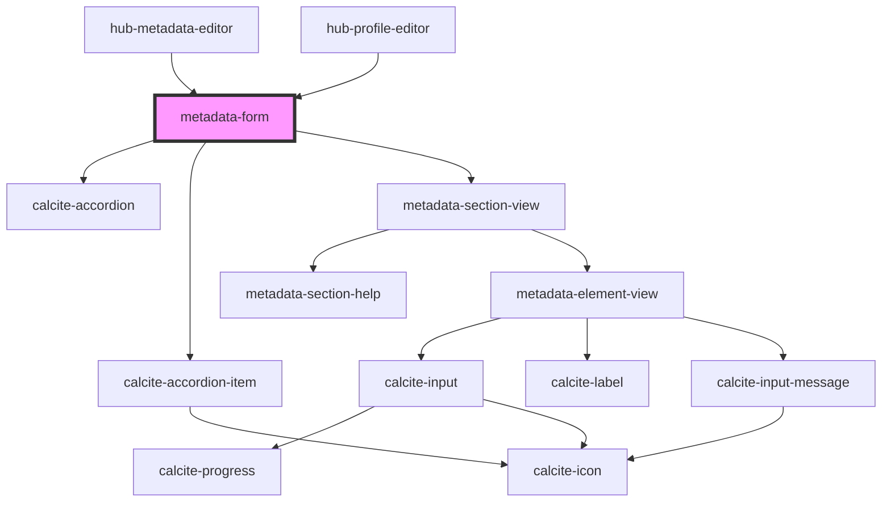

# metadata-form

<!-- Auto Generated Below -->

## Properties

| Property   | Attribute  | Description | Type       | Default |
| ---------- | ---------- | ----------- | ---------- | ------- |
| `locale`   | `locale`   |             | `string`   | `"en"`  |
| `resource` | `resource` |             | `any`      | `null`  |
| `sections` | --         |             | `string[]` | `[]`    |

## Dependencies

### Used by

 - [hub-metadata-editor](../../containers/hub-metadata-editor)
 - [hub-profile-editor](../../containers/hub-profile-editor)

### Depends on

- calcite-accordion
- calcite-accordion-item
- [metadata-section-view](../../presentation/metadata-section-view)

### Graph

----------------------------------------------

*Built with [StencilJS](https://stenciljs.com/)*
