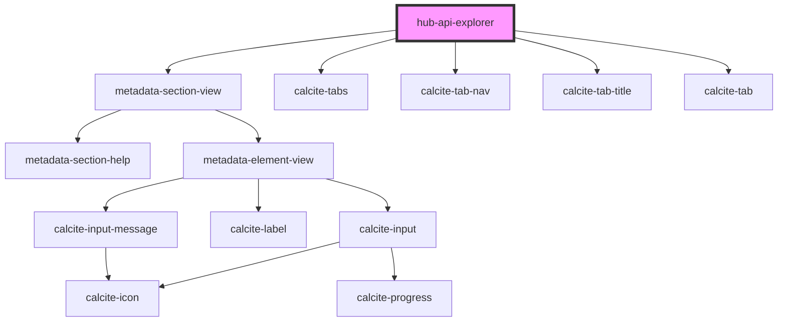

# hub-api-explorer

<!-- Auto Generated Below -->

## Properties

| Property | Attribute | Description | Type                                 | Default                                        |
| -------- | --------- | ----------- | ------------------------------------ | ---------------------------------------------- |
| `format` | `format`  |             | `"http" \| "javascript" \| "python"` | `"python"`                                     |
| `item`   | `item`    |             | `string`                             | `"4ef"`                                        |
| `url`    | `url`     |             | `string`                             | `"https://server.example.com/FeatureServer/0"` |

## Dependencies

### Depends on

- [metadata-section-view](../../presentation/metadata-section-view)
- calcite-tabs
- calcite-tab-nav
- calcite-tab-title
- calcite-tab

### Graph

----------------------------------------------

*Built with [StencilJS](https://stenciljs.com/)*
