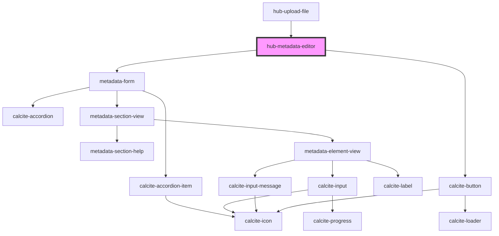

# hub-metadata-editor

<!-- Auto Generated Below -->

## Properties

| Property    | Attribute    | Description                                 | Type       | Default                              |
| ----------- | ------------ | ------------------------------------------- | ---------- | ------------------------------------ |
| `clientid`  | `clientid`   | ClientID to identify the app launching auth | `string`   | `"WXC842NRBVB6NZ2r"`                 |
| `item`      | `item`       |                                             | `string`   | `"1467319d449c44548bd63217f9b3c45a"` |
| `itemTitle` | `item-title` |                                             | `string`   | `undefined`                          |
| `portal`    | `portal`     |                                             | `string`   | `"https://www.arcgis.com"`           |
| `session`   | `session`    |                                             | `string`   | `null`                               |
| `summary`   | `summary`    |                                             | `string`   | `undefined`                          |
| `tags`      | --           |                                             | `string[]` | `[]`                                 |

## Dependencies

### Used by

 - [hub-upload-file](../../presentation/hub-upload-file)

### Depends on

- [metadata-form](../../blocks/metadata-form)
- calcite-button

### Graph

----------------------------------------------

*Built with [StencilJS](https://stenciljs.com/)*
