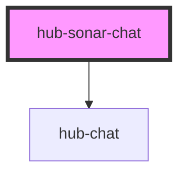

# hub-sonar-chat

<!-- Auto Generated Below -->

## Properties

| Property       | Attribute | Description | Type       | Default                                                                                                                                                              |
| -------------- | --------- | ----------- | ---------- | -------------------------------------------------------------------------------------------------------------------------------------------------------------------- |
| `sendMessages` | --        |             | `IHubChat` | `{messages: [     {text: "Welcome to Sonar", type: "text", user: "user2"},      {text: "Search for Datasets", type: "action", user: "user2", route: "/index"},   ]}` |
| `service`      | `service` |             | `string`   | `null`                                                                                                                                                               |

## Dependencies

### Depends on

- [hub-chat](../../elements/hub-chat)

### Graph

----------------------------------------------

*Built with [StencilJS](https://stenciljs.com/)*
