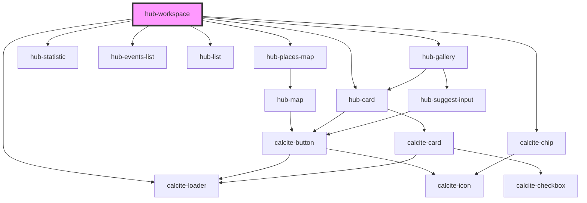

# hub-workspace

<!-- Auto Generated Below -->

## Properties

| Property  | Attribute | Description                            | Type     | Default     |
| --------- | --------- | -------------------------------------- | -------- | ----------- |
| `session` | `session` | Serialized authentication information. | `string` | `undefined` |

## Dependencies

### Depends on

- [hub-places-map](../../blocks/hub-places-map)
- [hub-statistic](../../blocks/hub-statistic)
- calcite-chip
- [hub-events-list](../../blocks/hub-events-list)
- [hub-list](../../presentation/hub-list)
- [hub-card](../../presentation/hub-card)
- [hub-gallery](../hub-gallery)
- calcite-loader

### Graph

----------------------------------------------

*Built with [StencilJS](https://stenciljs.com/)*
