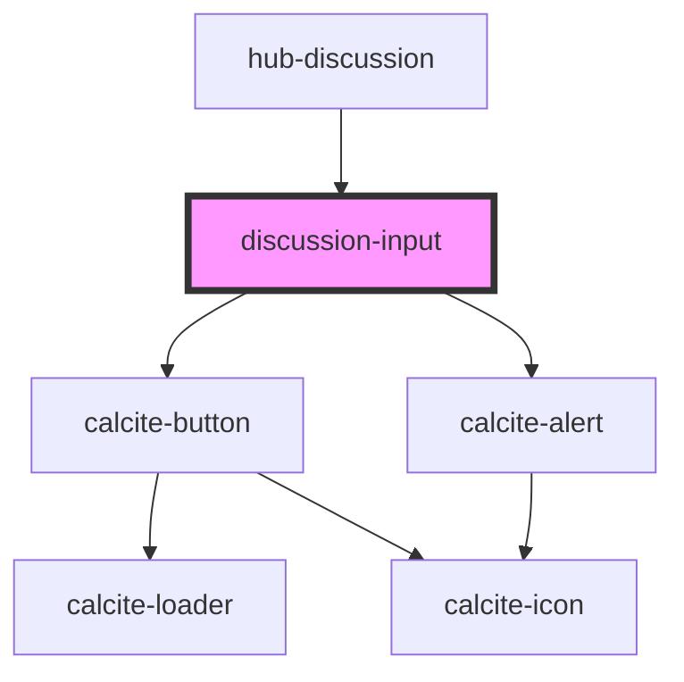

# discussion-input

<!-- Auto Generated Below -->

## Properties

| Property         | Attribute         | Description                            | Type     | Default                    |
| ---------------- | ----------------- | -------------------------------------- | -------- | -------------------------- |
| `annotationsUrl` | `annotations-url` |                                        | `string` | `undefined`                |
| `placeholder`    | `placeholder`     |                                        | `string` | `"Join the discussion..."` |
| `session`        | `session`         | Serialized authentication information. | `string` | `undefined`                |
| `submit`         | `submit`          |                                        | `string` | `"Share comment"`          |
| `target`         | `target`          |                                        | `string` | `undefined`                |

## Events

| Event                | Description | Type               |
| -------------------- | ----------- | ------------------ |
| `eventAddAnnotation` |             | `CustomEvent<any>` |

## Dependencies

### Used by

 - [hub-discussion](../hub-discussion)

### Depends on

- calcite-button
- calcite-alert

### Graph

----------------------------------------------

*Built with [StencilJS](https://stenciljs.com/)*
