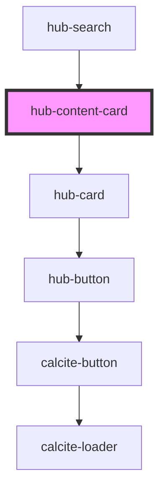

# hub-content-card

<!-- Auto Generated Below -->

## Properties

| Property       | Attribute       | Description | Type                         | Default                              |
| -------------- | --------------- | ----------- | ---------------------------- | ------------------------------------ |
| `actionButton` | `action-button` |             | `any`                        | `undefined`                          |
| `content`      | `content`       |             | `string`                     | `"4f5c78bfe89a4304aec3a6cfd492d0cd"` |
| `contentItem`  | --              |             | `IItem`                      | `null`                               |
| `layout`       | `layout`        |             | `"horizontal" \| "vertical"` | `"vertical"`                         |

## Dependencies

### Used by

 - [hub-search](../hub-search)

### Depends on

- [hub-card](../hub-card)

### Graph

----------------------------------------------

*Built with [StencilJS](https://stenciljs.com/)*
