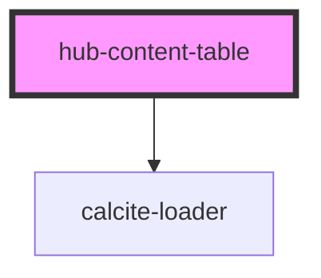

# hub-content-table

<!-- Auto Generated Below -->

## Properties

| Property | Attribute | Description                       | Type                                             | Default                  |
| -------- | --------- | --------------------------------- | ------------------------------------------------ | ------------------------ |
| `limit`  | `limit`   | Total number of results to return | `number`                                         | `1000`                   |
| `query`  | `query`   | Default query for the search      | `string`                                         | `"*"`                    |
| `site`   | `site`    | Hub site URL to scope for search  | `string`                                         | `"opendata.victoria.ca"` |
| `sort`   | `sort`    | Hub site URL to scope for search  | `"-modified" \| "-name" \| "modified" \| "name"` | `"name"`                 |

## Dependencies

### Depends on

- calcite-loader

### Graph

----------------------------------------------

*Built with [StencilJS](https://stenciljs.com/)*
