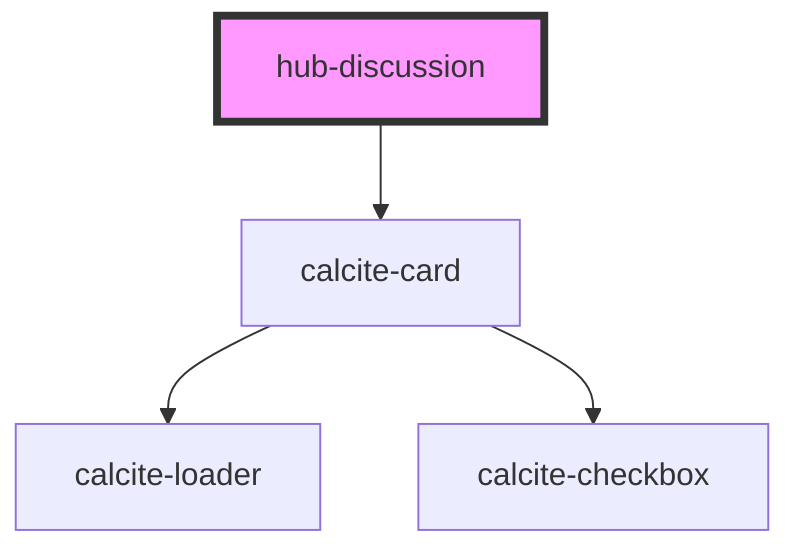

# hub-discussion

<!-- Auto Generated Below -->

## Properties

| Property         | Attribute         | Description | Type      | Default     |
| ---------------- | ----------------- | ----------- | --------- | ----------- |
| `annotationsUrl` | `annotations-url` |             | `string`  | `undefined` |
| `author`         | `author`          |             | `string`  | `undefined` |
| `org`            | `org`             |             | `string`  | `undefined` |
| `portalUrl`      | `portal-url`      |             | `string`  | `undefined` |
| `search`         | `search`          |             | `string`  | `undefined` |
| `target`         | `target`          |             | `string`  | `undefined` |
| `update`         | `update`          |             | `boolean` | `undefined` |

## Events

| Event                | Description | Type               |
| -------------------- | ----------- | ------------------ |
| `eventAddAnnotation` |             | `CustomEvent<any>` |

## Dependencies

### Depends on

- calcite-card

### Graph

----------------------------------------------

*Built with [StencilJS](https://stenciljs.com/)*
