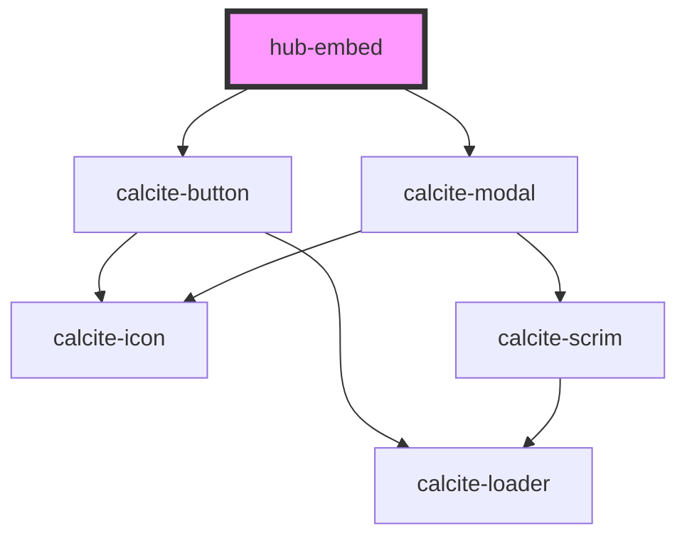

# hub-embed

<!-- Auto Generated Below -->

## Properties

| Property      | Attribute     | Description | Type     | Default                                                                                          |
| ------------- | ------------- | ----------- | -------- | ------------------------------------------------------------------------------------------------ |
| `code`        | `code`        |             | `string` | `'&gt;hub-survey&lt;'`                                                                           |
| `description` | `description` |             | `string` | `"You can add this card to your own site. Copy the code below and paste into your site editor."` |
| `title`       | `title`       |             | `string` | `"Embed this card"`                                                                              |

## Dependencies

### Depends on

- calcite-button
- calcite-modal

### Graph

----------------------------------------------

*Built with [StencilJS](https://stenciljs.com/)*
