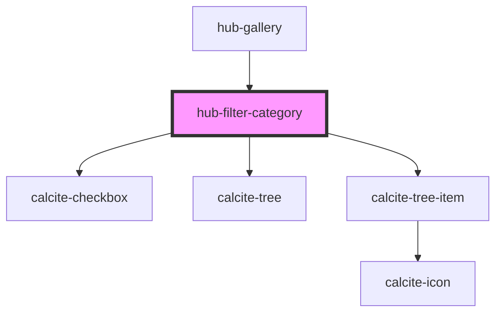

# hub-filter-category

<!-- Auto Generated Below -->

## Properties

| Property     | Attribute   | Description | Type                   | Default       |
| ------------ | ----------- | ----------- | ---------------------- | ------------- |
| `categories` | --          |             | `string[]`             | `[]`          |
| `facet`      | `facet`     |             | `string`               | `null`        |
| `facettype`  | `facettype` |             | `"checkbox" \| "tree"` | `"checkbox"`  |
| `group`      | `group`     |             | `string`               | `null`        |
| `name`       | `name`      |             | `string`               | `"Tree Type"` |
| `query`      | `query`     |             | `string`               | `"*"`         |

## Events

| Event           | Description | Type               |
| --------------- | ----------- | ------------------ |
| `filterChanged` |             | `CustomEvent<any>` |

## Dependencies

### Used by

 - [hub-gallery](../hub-gallery)

### Depends on

- calcite-checkbox
- calcite-tree
- calcite-tree-item

### Graph

----------------------------------------------

*Built with [StencilJS](https://stenciljs.com/)*
