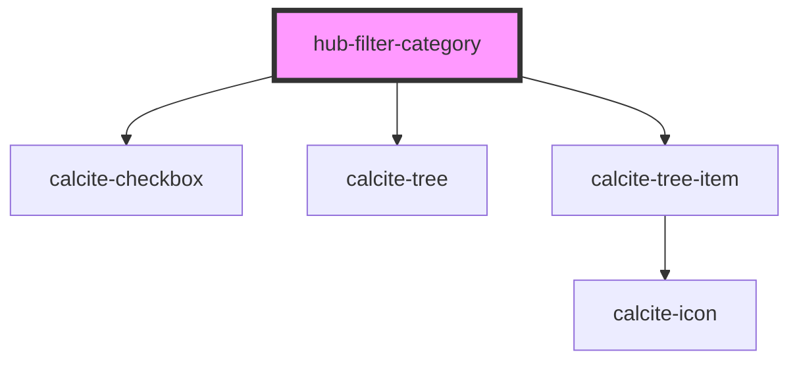

# hub-filter-category

<!-- Auto Generated Below -->

## Properties

| Property     | Attribute   | Description                                                   | Type                   | Default       |
| ------------ | ----------- | ------------------------------------------------------------- | ---------------------- | ------------- |
| `categories` | --          | List of categories to show. Can be set or inferred from facet | `string[]`             | `[]`          |
| `facet`      | `facet`     | Build filter from a facet name                                | `string`               | `null`        |
| `facettype`  | `facettype` | Type of facet                                                 | `"checkbox" \| "tree"` | `"checkbox"`  |
| `group`      | `group`     | For group categories, choose a groupid                        | `string`               | `null`        |
| `name`       | `name`      | Filter name to display at top                                 | `string`               | `"Tree Type"` |
| `query`      | `query`     | Input query for search box                                    | `string`               | `"*"`         |

## Events

| Event           | Description                      | Type               |
| --------------- | -------------------------------- | ------------------ |
| `filterChanged` | Emitted when a filter is changed | `CustomEvent<any>` |

## Dependencies

### Depends on

- calcite-checkbox
- calcite-tree
- calcite-tree-item

### Graph

----------------------------------------------

*Built with [StencilJS](https://stenciljs.com/)*
