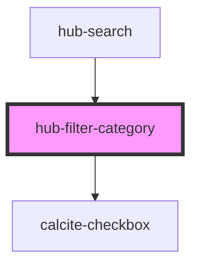

# hub-filter-category

<!-- Auto Generated Below -->

## Properties

| Property     | Attribute | Description | Type       | Default                     |
| ------------ | --------- | ----------- | ---------- | --------------------------- |
| `categories` | --        |             | `string[]` | `['Ash', 'Birch', 'Maple']` |
| `name`       | `name`    |             | `string`   | `"Tree Type"`               |

## Events

| Event           | Description | Type               |
| --------------- | ----------- | ------------------ |
| `filterChanged` |             | `CustomEvent<any>` |

## Dependencies

### Used by

 - [hub-search](../hub-search)

### Depends on

- calcite-checkbox

### Graph

----------------------------------------------

*Built with [StencilJS](https://stenciljs.com/)*
