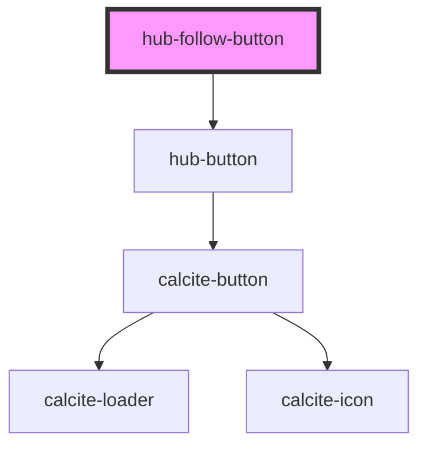

# hub-follow-button

<!-- Auto Generated Below -->

## Properties

| Property       | Attribute      | Description                                                              | Type      | Default                                                                                                                                                                                                                                                                                                                                                                                                                                                                                                                                                                                                                           |
| -------------- | -------------- | ------------------------------------------------------------------------ | --------- | --------------------------------------------------------------------------------------------------------------------------------------------------------------------------------------------------------------------------------------------------------------------------------------------------------------------------------------------------------------------------------------------------------------------------------------------------------------------------------------------------------------------------------------------------------------------------------------------------------------------------------- |
| `clientid`     | `clientid`     | ClientID to identify the app launching auth                              | `string`  | `undefined`                                                                                                                                                                                                                                                                                                                                                                                                                                                                                                                                                                                                                       |
| `following`    | `following`    | Denotes whether the user is already following the configured initiative. | `boolean` | `false`                                                                                                                                                                                                                                                                                                                                                                                                                                                                                                                                                                                                                           |
| `followtext`   | `followtext`   | Text to show in the string when not yet followed                         | `string`  | `"Follow Our Initiative"`                                                                                                                                                                                                                                                                                                                                                                                                                                                                                                                                                                                                         |
| `icon`         | --             | Follow icon                                                              | `Element` | `<svg /*draggable="auto"*/ class="follow-icon" viewBox="0 0 120 120" width="100%" height="100%"><circle cx="18.385" cy="101.615" r="18.385"></circle><path d="M-1.031 61c32.533 0 59 26.468 59 59s-26.467 59-59 59-59-26.468-59-59 26.467-59 59-59m0-23c-45.288 0-82 36.713-82 82s36.712 82 82 82 82-36.713 82-82-36.712-82-82-82z"></path><path d="M.154 23.041c53.349 0 96.75 43.402 96.75 96.75s-43.402 96.75-96.75 96.75-96.75-43.402-96.75-96.75 43.402-96.75 96.75-96.75m0-23c-66.136 0-119.75 53.615-119.75 119.75s53.614 119.75 119.75 119.75c66.135 0 119.75-53.615 119.75-119.75S66.289.041.154.041z"></path>   </svg>` |
| `initiativeid` | `initiativeid` | identifier for the ArcGIS Hub initiative                                 | `string`  | `undefined`                                                                                                                                                                                                                                                                                                                                                                                                                                                                                                                                                                                                                       |
| `orgurl`       | `orgurl`       | url of the ArcGIS Online organization                                    | `string`  | `"https://www.arcgis.com"`                                                                                                                                                                                                                                                                                                                                                                                                                                                                                                                                                                                                        |
| `session`      | `session`      | Serialized authentication information.                                   | `string`  | `undefined`                                                                                                                                                                                                                                                                                                                                                                                                                                                                                                                                                                                                                       |
| `unfollowtext` | `unfollowtext` | Text to show in the string for user to unfollw                           | `string`  | `"Unfollow Our Initiative"`                                                                                                                                                                                                                                                                                                                                                                                                                                                                                                                                                                                                       |
| `user`         | --             | User metadata                                                            | `IUser`   | `undefined`                                                                                                                                                                                                                                                                                                                                                                                                                                                                                                                                                                                                                       |

## Dependencies

### Depends on

- [hub-button](../hub-button)

### Graph

----------------------------------------------

*Built with [StencilJS](https://stenciljs.com/)*
