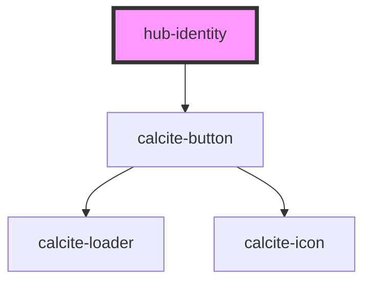

# hub-identity

<!-- Auto Generated Below -->

## Properties

| Property         | Attribute        | Description                                  | Type      | Default                    |
| ---------------- | ---------------- | -------------------------------------------- | --------- | -------------------------- |
| `clientid`       | `clientid`       | ClientID to identify the app launching OAuth | `string`  | `undefined`                |
| `displaysignin`  | `displaysignin`  |                                              | `boolean` | `true`                     |
| `displaysignout` | `displaysignout` |                                              | `boolean` | `true`                     |
| `orgurl`         | `orgurl`         | url of the ArcGIS Online organization        | `string`  | `"https://www.arcgis.com"` |
| `session`        | `session`        | Serialized authentication information.       | `string`  | `undefined`                |
| `signin`         | `signin`         |                                              | `string`  | `"Sign In"`                |
| `signout`        | `signout`        |                                              | `string`  | `"Sign Out"`               |

## Dependencies

### Depends on

- calcite-button

### Graph

----------------------------------------------

*Built with [StencilJS](https://stenciljs.com/)*
