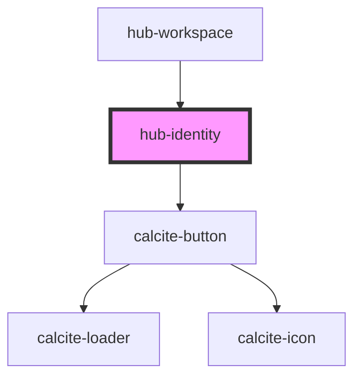

# hub-identity

<!-- Auto Generated Below -->

## Properties

| Property   | Attribute  | Description                                  | Type     | Default                    |
| ---------- | ---------- | -------------------------------------------- | -------- | -------------------------- |
| `clientid` | `clientid` | ClientID to identify the app launching OAuth | `string` | `undefined`                |
| `message`  | `message`  |                                              | `string` | `"Sign In"`                |
| `orgurl`   | `orgurl`   | url of the ArcGIS Online organization        | `string` | `"https://www.arcgis.com"` |
| `session`  | `session`  | Serialized authentication information.       | `string` | `undefined`                |

## Dependencies

### Used by

 - [hub-workspace](../hub-workspace)

### Depends on

- calcite-button

### Graph

----------------------------------------------

*Built with [StencilJS](https://stenciljs.com/)*
