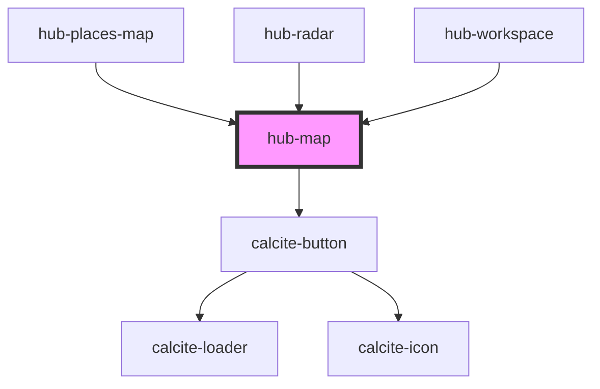

# hub-radar-map

```js
<div style="height: 500px"><hub-map center="[-77, 38]" zoom="14"></hub-map></div>
```

## Load a webmap

```js
<div style="height: 500px"><hub-map webmap="2e725f2d5b7640b28121af931048894c"></hub-map></div>
```


<!-- Auto Generated Below -->


## Properties

| Property         | Attribute         | Description                                | Type      | Default     |
| ---------------- | ----------------- | ------------------------------------------ | --------- | ----------- |
| `center`         | `center`          | Center of the map, "[longitude, latitude]" | `string`  | `undefined` |
| `drawing`        | `drawing`         | Option to show drawing tools               | `boolean` | `false`     |
| `showFullscreen` | `show-fullscreen` |                                            | `boolean` | `false`     |
| `webmap`         | `webmap`          | Webmap Item configuration to load          | `string`  | `undefined` |
| `zoom`           | `zoom`            | Map zoom level: 1=world ... 20=street      | `number`  | `4`         |


## Events

| Event             | Description                          | Type               |
| ----------------- | ------------------------------------ | ------------------ |
| `drawingComplete` | Sends event when drawing is complete | `CustomEvent<any>` |


## Dependencies

### Used by

 - [hub-places-map](../hub-places-map)
 - [hub-radar](../hub-radar)
 - [hub-workspace](../hub-workspace)

### Depends on

- calcite-button

### Graph


----------------------------------------------

*Built with [StencilJS](https://stenciljs.com/)*
