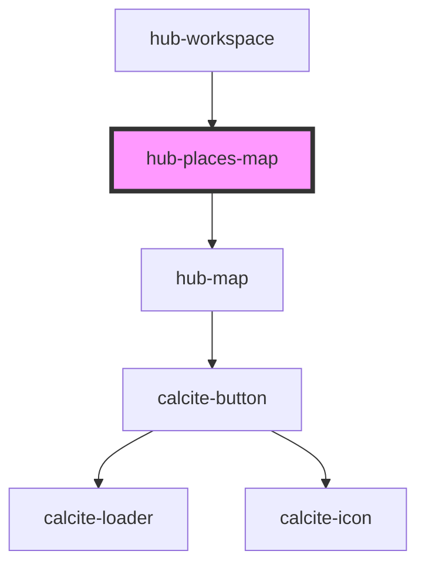

# hub-places-map

<!-- Auto Generated Below -->

## Properties

| Property  | Attribute | Description                                   | Type               | Default     |
| --------- | --------- | --------------------------------------------- | ------------------ | ----------- |
| `mode`    | `mode`    | Option to view places map, or edit places map | `"edit" \| "view"` | `"view"`    |
| `places`  | --        |                                               | `IHubGeography[]`  | `[]`        |
| `session` | `session` | Serialized authentication information.        | `string`           | `undefined` |

## Dependencies

### Used by

 - [hub-workspace](../hub-workspace)

### Depends on

- [hub-map](../hub-map)

### Graph

----------------------------------------------

*Built with [StencilJS](https://stenciljs.com/)*
