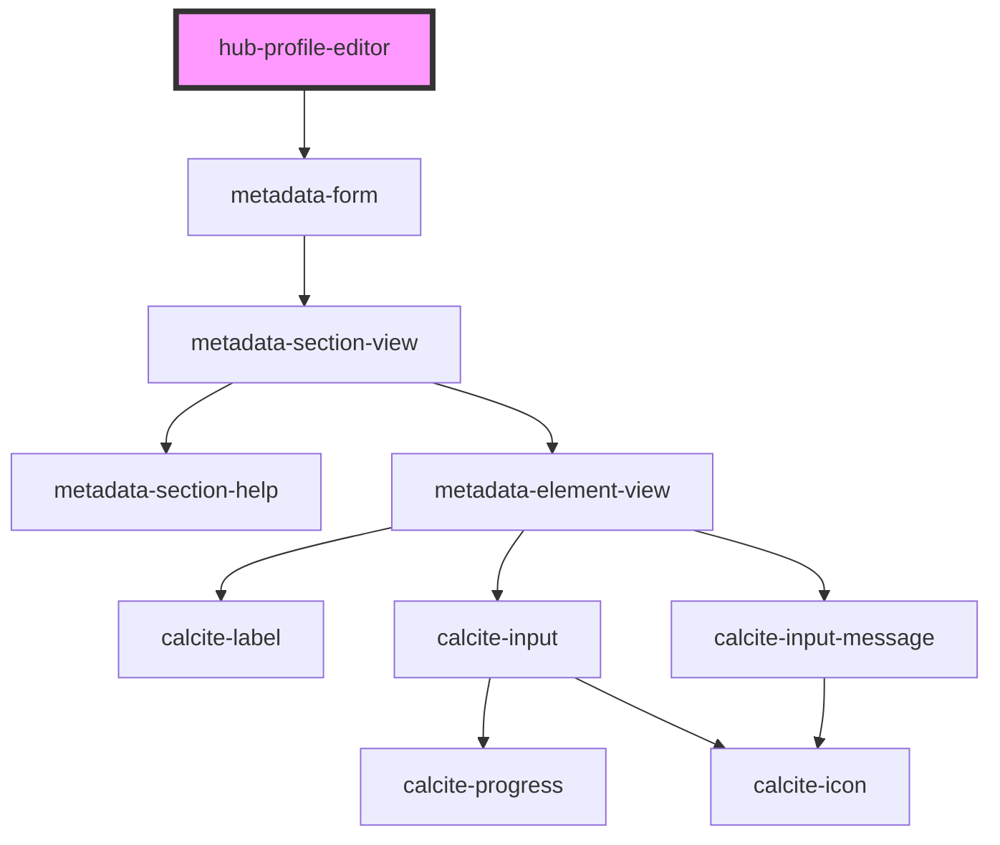

# hub-profile-editor

<!-- Auto Generated Below -->

## Properties

| Property   | Attribute  | Description                                 | Type     | Default                    |
| ---------- | ---------- | ------------------------------------------- | -------- | -------------------------- |
| `clientid` | `clientid` | ClientID to identify the app launching auth | `string` | `"WXC842NRBVB6NZ2r"`       |
| `portal`   | `portal`   |                                             | `string` | `"https://www.arcgis.com"` |
| `session`  | `session`  |                                             | `string` | `null`                     |
| `username` | `username` |                                             | `string` | `"ajturner"`               |

## Dependencies

### Depends on

- [metadata-form](../metadata-form)

### Graph

----------------------------------------------

*Built with [StencilJS](https://stenciljs.com/)*
