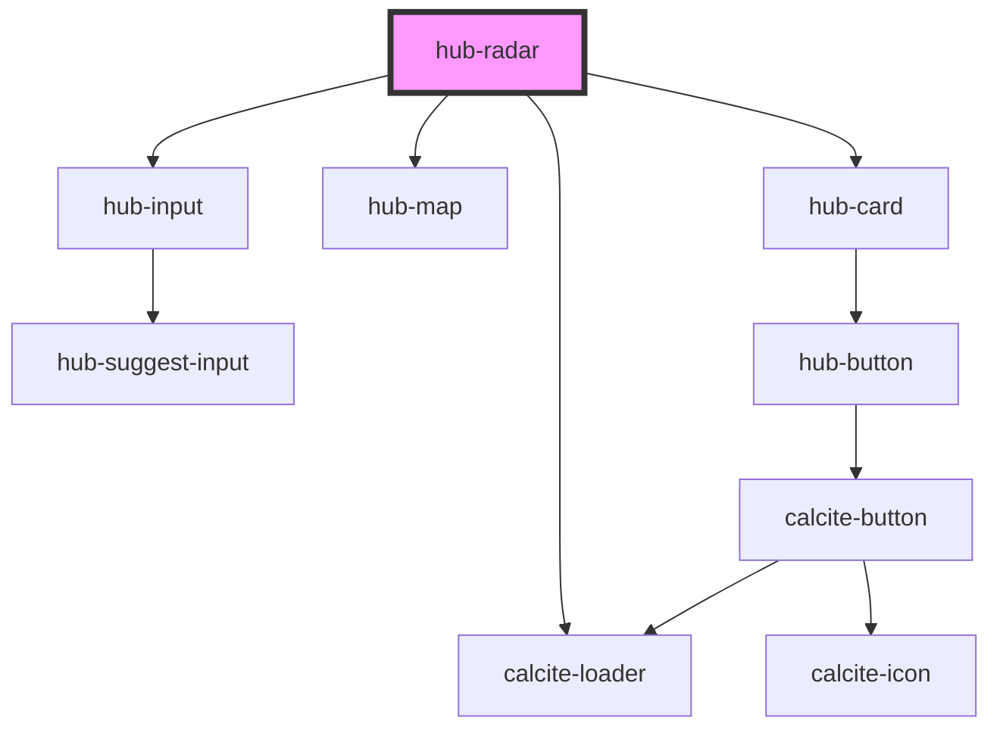

# hub-radar

## Simple Embed
```js
<hub-radar></hub-radar>
```

## Auto load an address

```js
<hub-radar showmap=true webmap="2e725f2d5b7640b28121af931048894c" address="4321 12th St NE">
</hub-radar>
```

## Add additional information

using `slots`

```js
<hub-radar showmap=true webmap="2e725f2d5b7640b28121af931048894c" address="4321 12th St NE">
      <strong style="margin-left: 8px;" slot="before-input">Search your DC address</strong>
      <em slot="after-results">Visit <a href="https://opendata.dc.gov">OpenData</a></em>
</hub-radar>
```


<!-- Auto Generated Below -->


## Properties

| Property      | Attribute       | Description | Type      | Default     |
| ------------- | --------------- | ----------- | --------- | ----------- |
| `address`     | `address`       |             | `string`  | `undefined` |
| `mapCenter`   | `map-center`    |             | `string`  | `undefined` |
| `mapItem`     | `map-item`      |             | `any`     | `undefined` |
| `mapItemData` | `map-item-data` |             | `any`     | `undefined` |
| `mapZoom`     | `map-zoom`      |             | `number`  | `undefined` |
| `messages`    | `messages`      |             | `any`     | `undefined` |
| `showmap`     | `showmap`       |             | `boolean` | `true`      |
| `webmap`      | `webmap`        |             | `string`  | `undefined` |


## Dependencies

### Depends on

- [hub-input](../hub-input)
- [hub-map](../hub-map)
- calcite-loader
- [hub-card](../hub-card)

### Graph


----------------------------------------------

*Built with [StencilJS](https://stenciljs.com/)*
