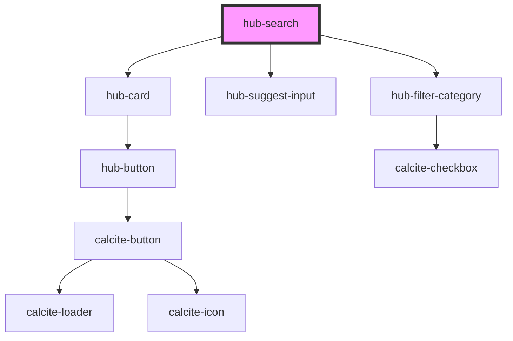

# hub-search

<!-- Auto Generated Below -->

## Properties

| Property   | Attribute  | Description                      | Type                         | Default                    |
| ---------- | ---------- | -------------------------------- | ---------------------------- | -------------------------- |
| `clientid` | `clientid` |                                  | `string`                     | `"WXC842NRBVB6NZ2r"`       |
| `layout`   | `layout`   | Hub site URL to scope for search | `"horizontal" \| "vertical"` | `"horizontal"`             |
| `portal`   | `portal`   |                                  | `string`                     | `"https://www.arcgis.com"` |
| `site`     | `site`     | Hub site URL to scope for search | `string`                     | `""`                       |
| `sort`     | `sort`     | Hub site URL to scope for search | `"modified" \| "name"`       | `"name"`                   |

## Dependencies

### Depends on

- [hub-card](../hub-card)
- [hub-suggest-input](../hub-suggest-input)
- [hub-filter-category](../hub-filter-category)

### Graph

----------------------------------------------

*Built with [StencilJS](https://stenciljs.com/)*
