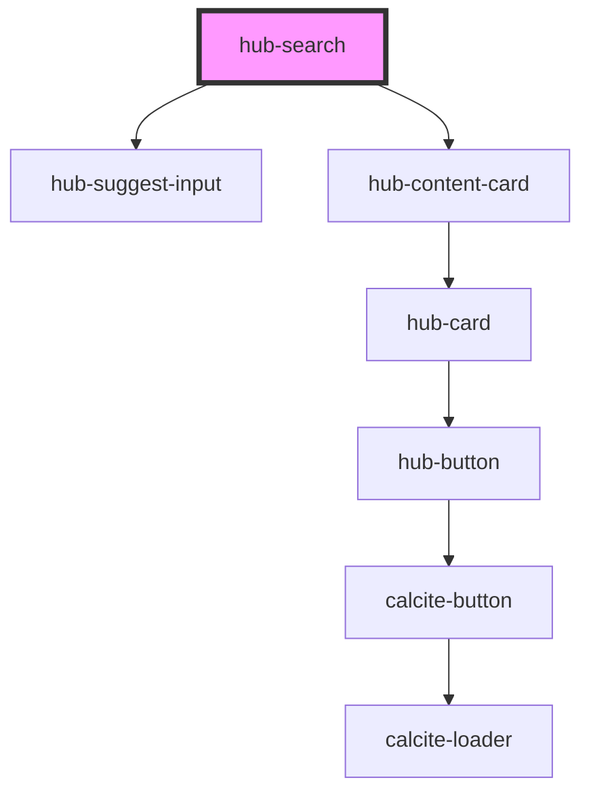

# hub-search

<!-- Auto Generated Below -->

## Properties

| Property | Attribute | Description                      | Type                   | Default  |
| -------- | --------- | -------------------------------- | ---------------------- | -------- |
| `site`   | `site`    | Hub site URL to scope for search | `string`               | `""`     |
| `sort`   | `sort`    | Hub site URL to scope for search | `"modified" \| "name"` | `"name"` |

## Dependencies

### Depends on

- [hub-suggest-input](../hub-suggest-input)
- [hub-content-card](../hub-content-card)

### Graph

----------------------------------------------

*Built with [StencilJS](https://stenciljs.com/)*
