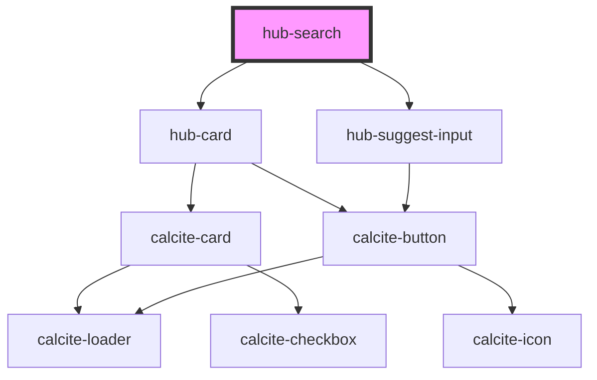

# hub-search

<!-- Auto Generated Below -->

## Properties

| Property            | Attribute           | Description                      | Type                         | Default                    |
| ------------------- | ------------------- | -------------------------------- | ---------------------------- | -------------------------- |
| `buttontext`        | `buttontext`        | Text to show in the button       | `string`                     | `"Explore"`                |
| `clientid`          | `clientid`          |                                  | `string`                     | `"WXC842NRBVB6NZ2r"`       |
| `groups`            | `groups`            | Groups to limit search           | `string`                     | `undefined`                |
| `layout`            | `layout`            | Hub site URL to scope for search | `"horizontal" \| "vertical"` | `"horizontal"`             |
| `portal`            | `portal`            |                                  | `string`                     | `"https://www.arcgis.com"` |
| `query`             | `query`             | Default Query                    | `string`                     | `""`                       |
| `searchbutton`      | `searchbutton`      | Search Button text               | `string`                     | `"Start Search"`           |
| `searchplaceholder` | `searchplaceholder` | Search placeholder text          | `string`                     | `"Search for content"`     |
| `showsearch`        | `showsearch`        | Choose to show or hide search    | `boolean`                    | `true`                     |
| `site`              | `site`              | Hub site URL to scope for search | `string`                     | `""`                       |
| `sort`              | `sort`              | Default sort order               | `"modified" \| "name"`       | `"name"`                   |

## Dependencies

### Depends on

- [hub-card](../hub-card)
- [hub-suggest-input](../hub-suggest-input)

### Graph

----------------------------------------------

*Built with [StencilJS](https://stenciljs.com/)*
