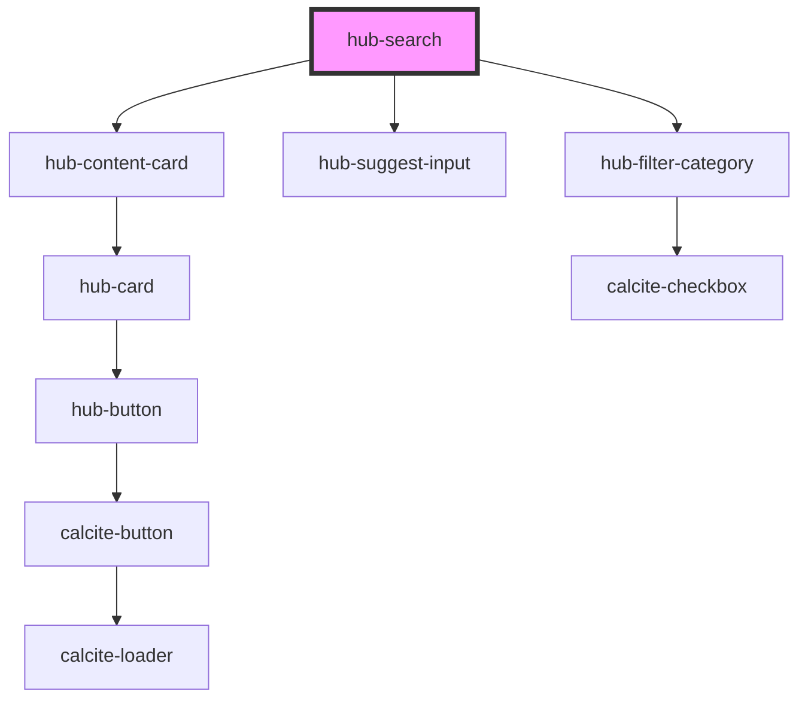

# hub-search

<!-- Auto Generated Below -->

## Properties

| Property | Attribute | Description                      | Type                         | Default        |
| -------- | --------- | -------------------------------- | ---------------------------- | -------------- |
| `layout` | `layout`  | Hub site URL to scope for search | `"horizontal" \| "vertical"` | `"horizontal"` |
| `site`   | `site`    | Hub site URL to scope for search | `string`                     | `""`           |
| `sort`   | `sort`    | Hub site URL to scope for search | `"modified" \| "name"`       | `"name"`       |

## Dependencies

### Depends on

- [hub-content-card](../hub-content-card)
- [hub-suggest-input](../hub-suggest-input)
- [hub-filter-category](../hub-filter-category)

### Graph

----------------------------------------------

*Built with [StencilJS](https://stenciljs.com/)*
