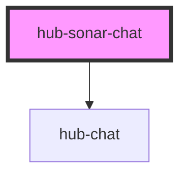

# hub-sonar-chat

<!-- Auto Generated Below -->

## Properties

| Property          | Attribute | Description | Type       | Default                                                                                                                                           |
| ----------------- | --------- | ----------- | ---------- | ------------------------------------------------------------------------------------------------------------------------------------------------- |
| `welcomeMessages` | --        |             | `IHubChat` | `{messages: [     {text: "Welcome to Sonar", type: "text", user: "user"},      {text: "Search for Datasets", type: "action", user: "user"},   ]}` |

## Dependencies

### Depends on

- [hub-chat](../hub-chat)

### Graph

----------------------------------------------

*Built with [StencilJS](https://stenciljs.com/)*
