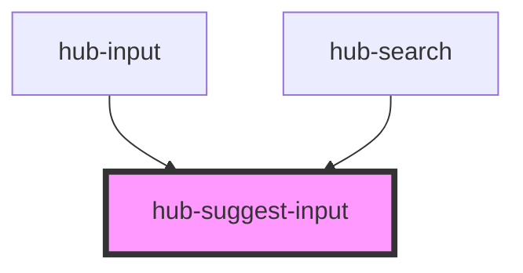

# hub-suggest-input

<!-- Auto Generated Below -->

## Properties

| Property      | Attribute     | Description                                             | Type       | Default                                                                      |
| ------------- | ------------- | ------------------------------------------------------- | ---------- | ---------------------------------------------------------------------------- |
| `extent`      | `extent`      | Geographic extent limit for geocoding                   | `any`      | `undefined`                                                                  |
| `placeholder` | `placeholder` | Value for input placeholder                             | `string`   | `"What are you looking for?"`                                                |
| `query`       | `query`       | Default search                                          | `string`   | `""`                                                                         |
| `submit`      | `submit`      | Value for submit button                                 | `string`   | `"Start Search"`                                                             |
| `suggestions` | --            | Values that the auto-complete textbox should search for | `string[]` | `['Apple', 'Avocado', 'Aardvark', 'Banana', 'Coconut', 'Cucumber', 'Mango']` |

## Events

| Event         | Description                         | Type               |
| ------------- | ----------------------------------- | ------------------ |
| `queryInput`  |                                     | `CustomEvent<any>` |
| `querySelect` | Emits the query of the input result | `CustomEvent<any>` |

## Dependencies

### Used by

 - [hub-input](../hub-input)
 - [hub-search](../hub-search)

### Graph

----------------------------------------------

*Built with [StencilJS](https://stenciljs.com/)*
