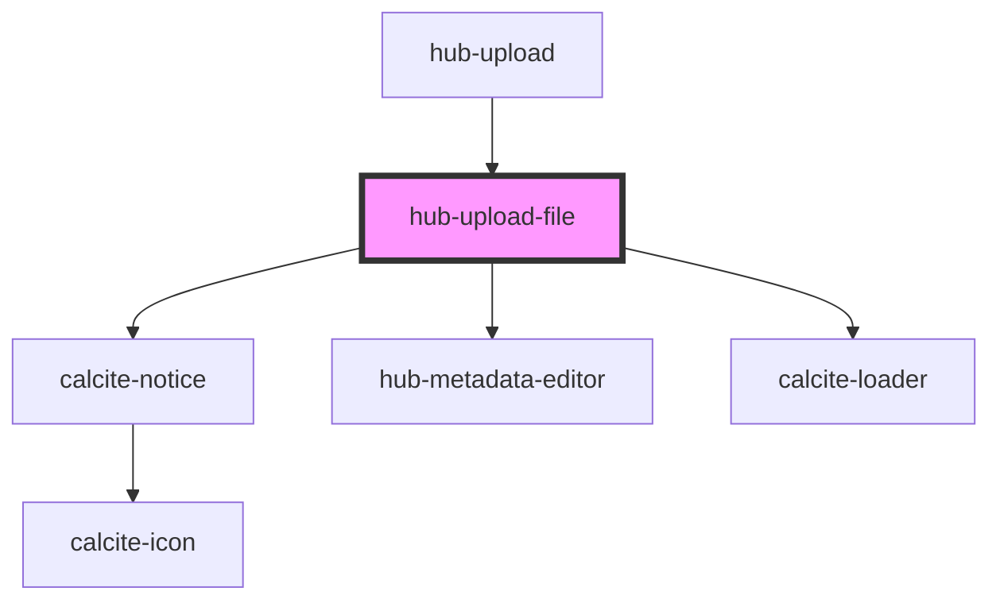

# hub-upload-file

<!-- Auto Generated Below -->

## Properties

| Property   | Attribute   | Description                                 | Type     | Default                    |
| ---------- | ----------- | ------------------------------------------- | -------- | -------------------------- |
| `clientid` | `clientid`  | ClientID to identify the app launching auth | `string` | `"WXC842NRBVB6NZ2r"`       |
| `file`     | --          |                                             | `File`   | `undefined`                |
| `itemType` | `item-type` |                                             | `string` | `undefined`                |
| `portal`   | `portal`    |                                             | `string` | `"https://www.arcgis.com"` |
| `session`  | `session`   |                                             | `string` | `undefined`                |

## Dependencies

### Used by

 - [hub-upload](../hub-upload)

### Depends on

- calcite-notice
- [hub-metadata-editor](../hub-metadata-editor)
- calcite-loader

### Graph

----------------------------------------------

*Built with [StencilJS](https://stenciljs.com/)*
