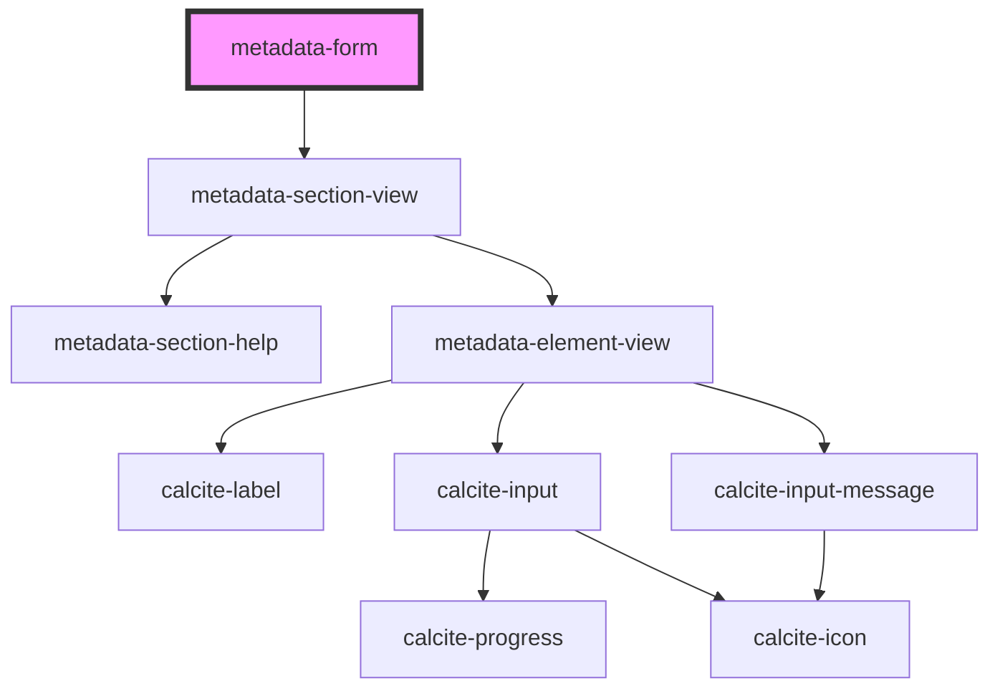

# metadata-form

<!-- Auto Generated Below -->

## Properties

| Property | Attribute | Description | Type     | Default    |
| -------- | --------- | ----------- | -------- | ---------- |
| `locale` | `locale`  |             | `string` | `"en"`     |
| `spec`   | `spec`    |             | `string` | `"arcgis"` |

## Dependencies

### Depends on

- [metadata-section-view](../metadata-section-view)

### Graph

----------------------------------------------

*Built with [StencilJS](https://stenciljs.com/)*
