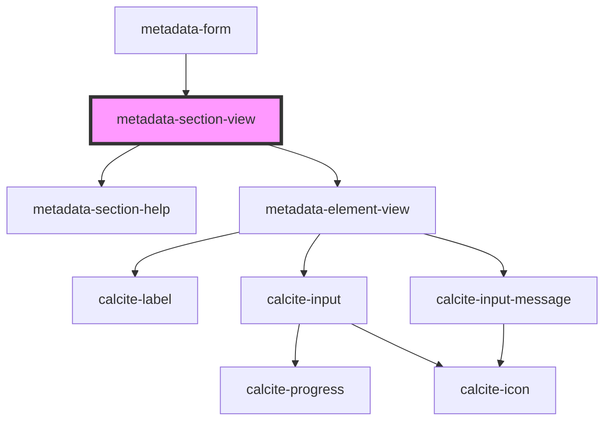

# metadata-section-view

<!-- Auto Generated Below -->

## Properties

| Property      | Attribute     | Description | Type     | Default |
| ------------- | ------------- | ----------- | -------- | ------- |
| `description` | `description` |             | `string` | `""`    |
| `inputs`      | --            |             | `any[]`  | `[]`    |
| `title`       | `title`       |             | `string` | `""`    |

## Dependencies

### Used by

 - [metadata-form](../metadata-form)

### Depends on

- [metadata-section-help](../metadata-section-help)
- [metadata-element-view](../metadata-element-view)

### Graph

----------------------------------------------

*Built with [StencilJS](https://stenciljs.com/)*
