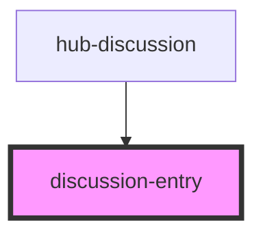

# discussion-entry

<!-- Auto Generated Below -->

## Properties

| Property        | Attribute        | Description | Type      | Default     |
| --------------- | ---------------- | ----------- | --------- | ----------- |
| `allowDelete`   | `allow-delete`   |             | `boolean` | `false`     |
| `allowEdit`     | `allow-edit`     |             | `boolean` | `false`     |
| `allowReply`    | `allow-reply`    |             | `boolean` | `true`      |
| `annotationId`  | `annotation-id`  |             | `string`  | `undefined` |
| `authorImage`   | `author-image`   |             | `string`  | `undefined` |
| `authorName`    | `author-name`    |             | `string`  | `undefined` |
| `description`   | `description`    |             | `string`  | `undefined` |
| `publishedDate` | `published-date` |             | `string`  | `undefined` |

## Events

| Event                   | Description | Type               |
| ----------------------- | ----------- | ------------------ |
| `eventDeleteAnnotation` |             | `CustomEvent<any>` |

## Dependencies

### Used by

 - [hub-discussion](../../containers/hub-discussion)

### Graph

----------------------------------------------

*Built with [StencilJS](https://stenciljs.com/)*
