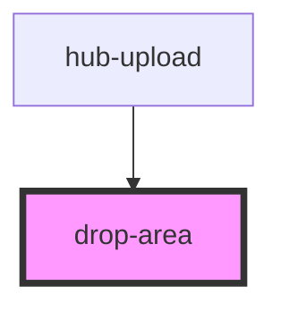

# drop-area

<!-- Auto Generated Below -->

## Properties

| Property       | Attribute | Description | Type       | Default       |
| -------------- | --------- | ----------- | ---------- | ------------- |
| `allowedTypes` | --        |             | `string[]` | `["image/*"]` |

## Events

| Event              | Description          | Type               |
| ------------------ | -------------------- | ------------------ |
| `onFilesSubmitted` | Emits the chat input | `CustomEvent<any>` |

## Dependencies

### Used by

 - [hub-upload](../../blocks/hub-upload)

### Graph

----------------------------------------------

*Built with [StencilJS](https://stenciljs.com/)*
