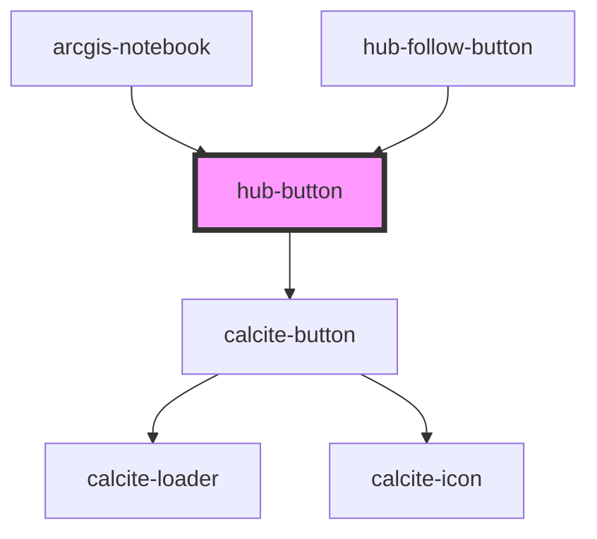

# hub-button

Simple button that can be used in other components. 

<!-- Auto Generated Below -->

## Properties

| Property | Attribute | Description                                  | Type       | Default                       |
| -------- | --------- | -------------------------------------------- | ---------- | ----------------------------- |
| `action` | --        | action to trigger when the button is clicked | `Function` | `function() { return 'foo' }` |
| `icon`   | --        | Icon to display alongside the text           | `Element`  | `undefined`                   |
| `text`   | `text`    | Button text to display                       | `string`   | `"Click Me"`                  |

## Dependencies

### Used by

 - [arcgis-notebook](../../blocks/arcgis-notebook)
 - [hub-follow-button](../../blocks/hub-follow-button)

### Depends on

- calcite-button

### Graph

----------------------------------------------

*Built with [StencilJS](https://stenciljs.com/)*
