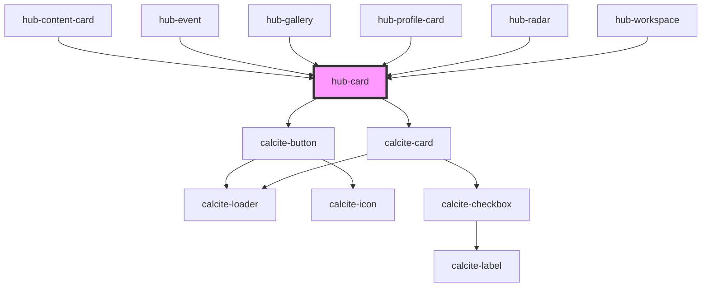

# hub-card

A rectangular card for showing content, optionally with an thumbnail image and link. 

<!-- Auto Generated Below -->

## Properties

| Property       | Attribute     | Description                    | Type                         | Default         |
| -------------- | ------------- | ------------------------------ | ---------------------------- | --------------- |
| `buttonAction` | --            |                                | `Function`                   | `undefined`     |
| `buttonText`   | `button-text` |                                | `string`                     | `"Explore"`     |
| `contenttype`  | `contenttype` |                                | `string`                     | `"Local Topic"` |
| `description`  | `description` |                                | `string`                     | `undefined`     |
| `image`        | `image`       |                                | `string`                     | `undefined`     |
| `item`         | `item`        |                                | `string`                     | `""`            |
| `layout`       | `layout`      | Specify the layout of the card | `"horizontal" \| "vertical"` | `"vertical"`    |
| `name`         | `name`        |                                | `string`                     | `undefined`     |
| `url`          | `url`         |                                | `string`                     | `undefined`     |

## Dependencies

### Used by

 - [hub-content-card](../../blocks/hub-content-card)
 - [hub-event](../../blocks/hub-event)
 - [hub-gallery](../../containers/hub-gallery)
 - [hub-profile-card](../../blocks/hub-profile-card)
 - [hub-radar](../../containers/hub-radar)
 - [hub-workspace](../../containers/hub-workspace)

### Depends on

- calcite-button
- calcite-card

### Graph

----------------------------------------------

*Built with [StencilJS](https://stenciljs.com/)*
