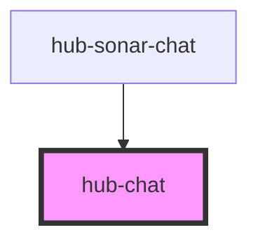

# hub-chat

<!-- Auto Generated Below -->

## Properties

| Property           | Attribute     | Description                                                                | Type       | Default               |
| ------------------ | ------------- | -------------------------------------------------------------------------- | ---------- | --------------------- |
| `incomingMessages` | --            | Set property to pass in messages. Can be used for default welcome message. | `IHubChat` | `undefined`           |
| `name`             | `name`        | Chat bot name                                                              | `string`   | `"Sonar"`             |
| `open`             | `open`        | Current (or default) open state of the chatbox                             | `boolean`  | `true`                |
| `placeholder`      | `placeholder` | Default input placeholder                                                  | `string`   | `"Send a message..."` |

## Events

| Event             | Description          | Type               |
| ----------------- | -------------------- | ------------------ |
| `onChatSubmitted` | Emits the chat input | `CustomEvent<any>` |

## Dependencies

### Used by

 - [hub-sonar-chat](../../containers/hub-sonar-chat)

### Graph

----------------------------------------------

*Built with [StencilJS](https://stenciljs.com/)*
