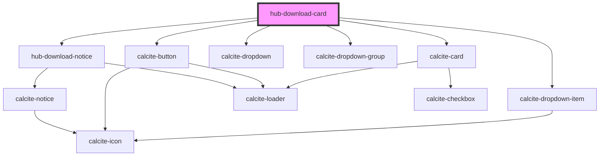

# hub-download-card

<!-- Auto Generated Below -->

## Properties

| Property       | Attribute        | Description | Type     | Default                   |
| -------------- | ---------------- | ----------- | -------- | ------------------------- |
| `datasetId`    | `dataset-id`     |             | `string` | `undefined`               |
| `filename`     | `filename`       |             | `string` | `undefined`               |
| `format`       | `format`         |             | `string` | `undefined`               |
| `geometry`     | `geometry`       |             | `string` | `undefined`               |
| `host`         | `host`           |             | `string` | `'http://localhost:3000'` |
| `name`         | `name`           |             | `string` | `undefined`               |
| `spatialRefId` | `spatial-ref-id` |             | `string` | `'4326'`                  |
| `target`       | `target`         |             | `string` | `undefined`               |
| `token`        | `token`          |             | `string` | `undefined`               |
| `username`     | `username`       |             | `string` | `undefined`               |
| `where`        | `where`          |             | `string` | `undefined`               |

## Dependencies

### Depends on

- [hub-download-notice](../hub-download-notice)
- calcite-button
- calcite-dropdown
- calcite-dropdown-group
- calcite-dropdown-item
- calcite-card

### Graph

----------------------------------------------

*Built with [StencilJS](https://stenciljs.com/)*
