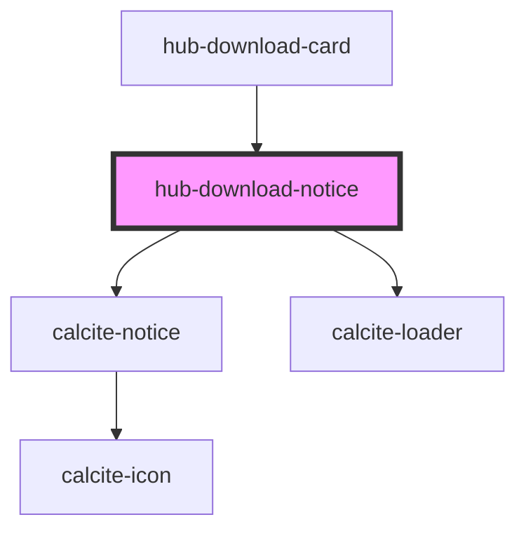

# hub-download-notice

<!-- Auto Generated Below -->

## Properties

| Property          | Attribute          | Description | Type      | Default     |
| ----------------- | ------------------ | ----------- | --------- | ----------- |
| `apiError`        | `api-error`        |             | `string`  | `undefined` |
| `cached`          | `cached`           |             | `boolean` | `false`     |
| `exportRequested` | `export-requested` |             | `boolean` | `false`     |
| `fileStatus`      | `file-status`      |             | `string`  | `undefined` |
| `lastEditDate`    | `last-edit-date`   |             | `string`  | `undefined` |

## Dependencies

### Used by

 - [hub-download-card](../hub-download-card)

### Depends on

- calcite-notice
- calcite-loader

### Graph

----------------------------------------------

*Built with [StencilJS](https://stenciljs.com/)*
