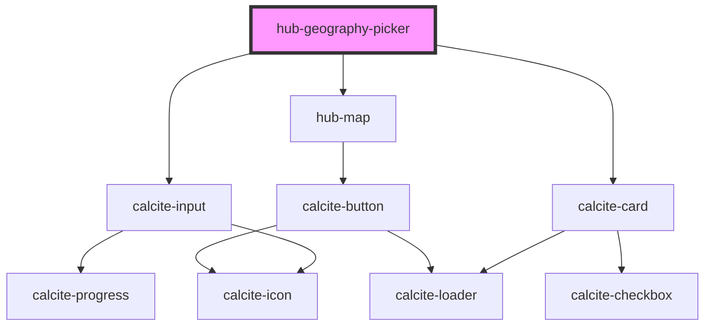

# hub-geography-picker

<!-- Auto Generated Below -->

## Properties

| Property        | Attribute        | Description                                                                                                      | Type              | Default     |
| --------------- | ---------------- | ---------------------------------------------------------------------------------------------------------------- | ----------------- | ----------- |
| `inputLocation` | `input-location` |                                                                                                                  | `string`          | `''`        |
| `location`      | `location`       | Default location to search                                                                                       | `string`          | `undefined` |
| `session`       | `session`        | Serialized authentication information.                                                                           | `string`          | `undefined` |
| `value`         | --               | Existing Hub places array of geography from metadata editor Property name `value` because re-used across editors | `IHubGeography[]` | `[]`        |

## Dependencies

### Depends on

- calcite-input
- calcite-card
- [hub-map](../../blocks/hub-map)

### Graph

----------------------------------------------

*Built with [StencilJS](https://stenciljs.com/)*
