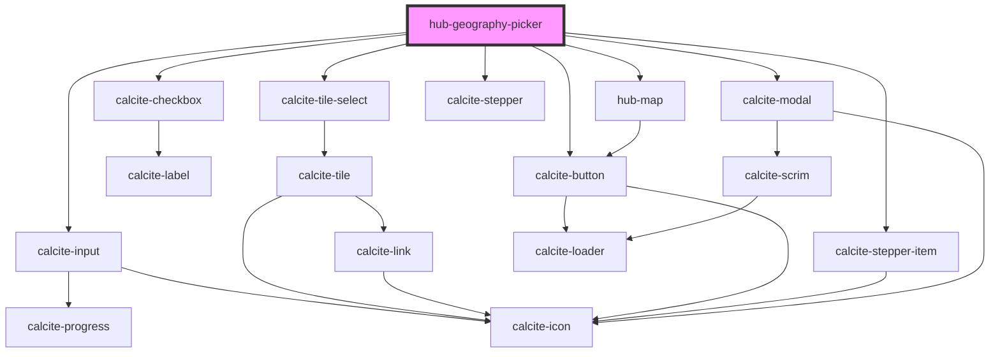

# hub-geography-picker

<!-- Auto Generated Below -->

## Properties

| Property    | Attribute   | Description                                                                                                      | Type              | Default     |
| ----------- | ----------- | ---------------------------------------------------------------------------------------------------------------- | ----------------- | ----------- |
| `location`  | `location`  |                                                                                                                  | `string`          | `''`        |
| `session`   | `session`   | Serialized authentication information.                                                                           | `string`          | `undefined` |
| `uistepper` | `uistepper` |                                                                                                                  | `boolean`         | `false`     |
| `value`     | --          | Existing Hub places array of geography from metadata editor Property name `value` because re-used across editors | `IHubGeography[]` | `[]`        |

## Dependencies

### Depends on

- calcite-input
- calcite-checkbox
- calcite-tile-select
- [hub-map](../../blocks/hub-map)
- calcite-stepper
- calcite-stepper-item
- calcite-modal
- calcite-button

### Graph

----------------------------------------------

*Built with [StencilJS](https://stenciljs.com/)*
