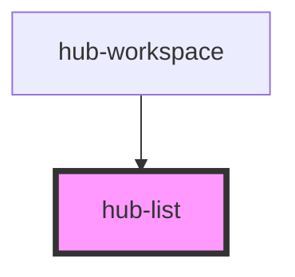

# hub-list

<!-- Auto Generated Below -->

## Properties

| Property     | Attribute | Description | Type             | Default     |
| ------------ | --------- | ----------- | ---------------- | ----------- |
| `collection` | --        |             | `IHubResource[]` | `undefined` |
| `icon`       | `icon`    |             | `string`         | `undefined` |
| `name`       | `name`    |             | `string`         | `undefined` |
| `summary`    | `summary` |             | `string`         | `undefined` |
| `url`        | `url`     |             | `string`         | `undefined` |

## Dependencies

### Used by

 - [hub-workspace](../../containers/hub-workspace)

### Graph

----------------------------------------------

*Built with [StencilJS](https://stenciljs.com/)*
